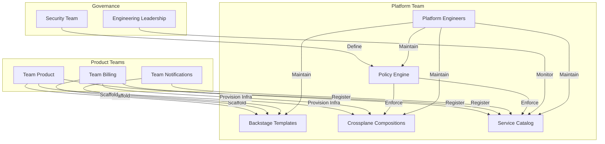
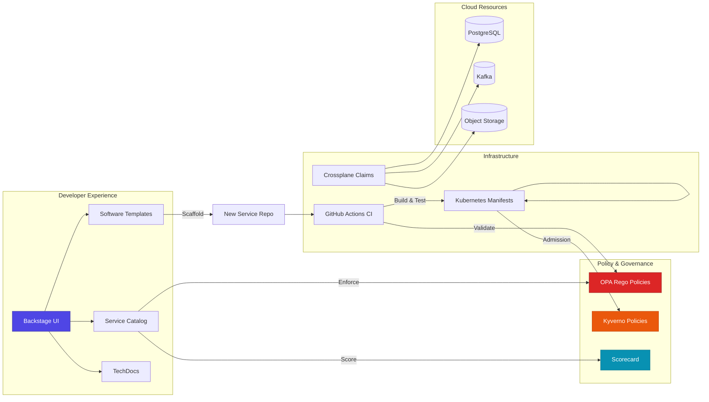
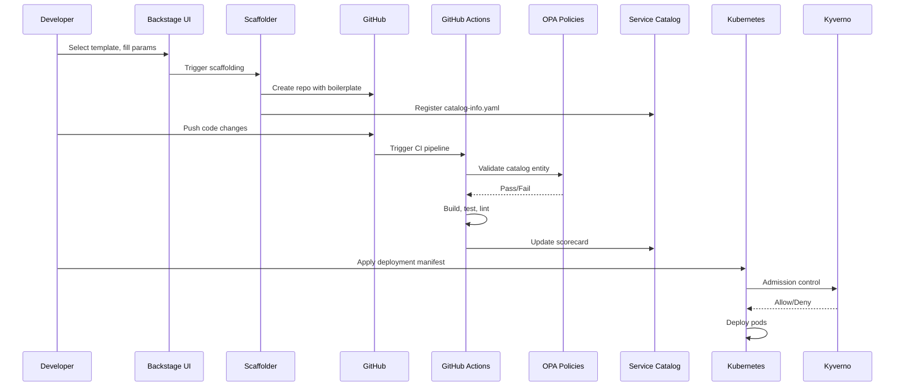
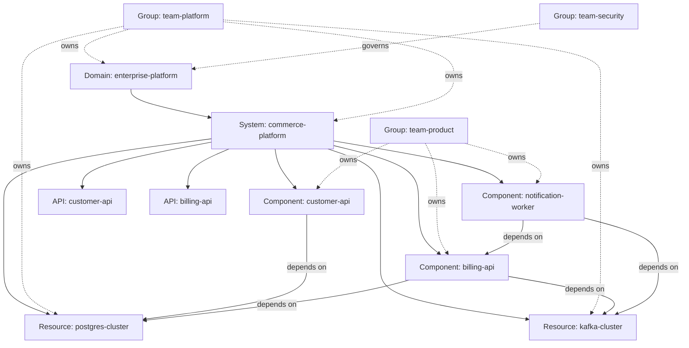
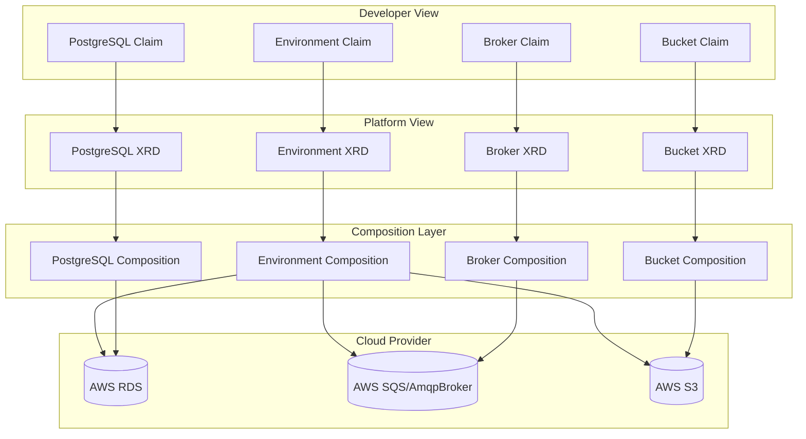

# 🏗️ Golden Path Platform

> **Enterprise Internal Developer Platform** — Standardized, policy-gated paths for building, deploying, and operating microservices at scale.

[](https://github.com/golden-path/golden-path-platform/actions/workflows/ci.yml)
[](LICENSE)
[](https://backstage.io)

---

## Table of Contents

- [Executive Summary](#executive-summary)
- [Business Problem](#business-problem)
- [Who This Is For](#who-this-is-for)
- [Platform Operating Model](#platform-operating-model)
- [The Golden Path Concept](#the-golden-path-concept)
- [Architecture Overview](#architecture-overview)
- [Service Onboarding Flow](#service-onboarding-flow)
- [Software Catalog Model](#software-catalog-model)
- [Production Readiness Model](#production-readiness-model)
- [Policy Gates (OPA + Kyverno)](#policy-gates-opa--kyverno)
- [Crossplane Abstraction Model](#crossplane-abstraction-model)
- [Repository Structure](#repository-structure)
- [Local Setup](#local-setup)
- [Demo Walkthrough](#demo-walkthrough)
- [Verification Commands](#verification-commands)
- [Enterprise Scaling Notes](#enterprise-scaling-notes)
- [Contributing](#contributing)
- [References](#references)

---

## Executive Summary

The **Golden Path Platform** is an internal developer platform (IDP) that provides
standardized, policy-gated pathways for engineering teams to build, deploy, and
operate production-grade microservices. Built on [Backstage](https://backstage.io),
the platform eliminates tribal knowledge, reduces time-to-first-deploy from days
to minutes, and enforces organizational standards automatically.

This repository contains the **complete platform definition** — from the Backstage
application and software templates, through the service catalog and policy engine,
to the infrastructure-as-code manifests and Crossplane claims. It is the single
source of truth for how services are created, registered, validated, and operated
within the enterprise.

### What You Get

| Capability | Description | Implementation |
|-----------|-------------|----------------|
| **Service Catalog** | Centralized registry of all services, APIs, teams, and resources | Backstage Software Catalog (`catalog/`) |
| **Software Templates** | One-click scaffolding for new services, APIs, ADRs, and runbooks | Backstage Scaffolder (`templates/`) |
| **Production Readiness Scorecard** | 10-point automated readiness validation | `scripts/scorecard.py` |
| **Catalog Validation** | Schema enforcement on catalog entities | `scripts/validate-catalog.py` |
| **Policy Gates (OPA)** | Rego policies for catalog compliance | `policies/opa/` (5 policies + tests) |
| **Policy Gates (Kyverno)** | Kubernetes admission control policies | `policies/kyverno/` (4 policies) |
| **Infrastructure Manifests** | Reference K8s manifests (Deployment, HPA, PDB, Ingress, etc.) | `infra/k8s/` (8 manifests) |
| **Crossplane Claims** | Self-service infrastructure provisioning | `infra/crossplane/` (4 claims) |
| **CI/CD Pipeline** | GitHub Actions for build, validation, and policy testing | `.github/workflows/ci.yml` |
| **Architecture Decision Records** | Documented platform design decisions | `docs/adr/` (4 ADRs) |
| **Operational Runbooks** | Step-by-step procedures for service lifecycle | `docs/runbooks/` (4 runbooks) |
| **Reference Services** | Example services demonstrating golden path patterns | `examples/services/` (2 services) |

---

## Business Problem

Modern engineering organizations face a paradox: as teams grow, the cost of
maintaining consistency grows faster than the capacity to enforce it. Without
an internal developer platform, organizations suffer from:

### Without a Golden Path

| Problem | Impact | Cost |
|---------|--------|------|
| **Service sprawl** | 150+ services, no centralized inventory | Hours wasted searching for existing solutions |
| **Inconsistent scaffolding** | Each team bootstraps differently | 2-5 days to first deploy per new service |
| **Tribal knowledge** | "Who owns this?" is unanswerable | Incident response delayed by hours |
| **Policy blindness** | No way to enforce standards | Security vulnerabilities, compliance gaps |
| **Infrastructure bottlenecks** | Manual ticket-based provisioning | 3-5 day wait for database/queue setup |
| **Documentation decay** | Scattered across Confluence, wikis, READMEs | Engineers can't find what they need |
| **No production readiness validation** | Services promoted without meeting standards | Production incidents from untested services |

### With a Golden Path

| Before | After |
|--------|-------|
| 2-5 days to first deploy | **< 10 minutes** to scaffolded, registered, CI-enabled service |
| "Who owns this?" → Slack DMs | **Single click** → owner, dashboard, docs, dependencies |
| Security review = email chain | **Automated policy gates** enforce standards at PR time |
| Infrastructure = Jira ticket | **Self-service Crossplane claims** provision in minutes |
| "Is this service ready?" = guessing | **10-point scorecard** gives objective readiness score |
| Docs in 4+ tools | **TechDocs** renders docs from source code |

---

## Who This Is For

The platform serves four primary stakeholder groups, each with different needs:

### Platform Engineers (Building the Platform)

> "We need to provide golden paths that teams actually want to use."

- **Own**: Backstage configuration, templates, policies, Crossplane compositions
- **Care about**: Platform reliability, policy coverage, developer experience
- **Use**: Template authoring, policy development, infrastructure abstraction
- **See**: `templates/`, `policies/`, `infra/crossplane/`, `app/backstage/`

### Product Developers (Consuming the Platform)

> "I want to create a new service without filing tickets or reading wiki pages."

- **Own**: Application code, service reliability, business logic
- **Care about**: Time-to-first-deploy, self-service, clear documentation
- **Use**: Scaffolder templates, catalog registration, scorecard validation
- **See**: `templates/new-http-service/`, `examples/services/`

### Security & Compliance Teams

> "We need every service to meet baseline security and compliance standards."

- **Own**: Security policy definition, compliance auditing, threat modeling
- **Care about**: Policy enforcement, audit trails, data classification
- **Use**: OPA policy authoring, catalog policy validation, scorecard checks
- **See**: `policies/opa/`, `policies/kyverno/`, `docs/adr/0003`

### Engineering Leadership

> "We need visibility into service health, ownership, and readiness."

- **Own**: Organizational strategy, team structure, investment decisions
- **Care about**: Metrics, readiness trends, adoption rates, risk reduction
- **Use**: Catalog dashboards, scorecard reports, architecture diagrams
- **See**: `docs/architecture/`, `docs/diagrams/`

---

## Platform Operating Model

The platform operates on a **hub-and-spoke** model where the platform team
provides shared capabilities (golden paths, policies, infrastructure) and
product teams consume them through self-service interfaces.



### Interaction Model

| Interaction | Who | How | Frequency |
|------------|-----|-----|-----------|
| Create new service | Product Dev | Backstage Scaffolder UI | On-demand |
| Register existing service | Product Dev | Add `catalog-info.yaml` to repo | One-time per service |
| Request infrastructure | Product Dev | Submit Crossplane Claim via template | On-demand |
| Validate catalog | Platform Team | `make catalog-validate` | CI (every PR) |
| Run scorecard | Product Dev | `make scorecard` | Before production promotion |
| Update policies | Security Team | Edit Rego/Kyverno files, PR review | Monthly cadence |
| View service health | Leadership | Backstage Catalog UI | Anytime |

---

## The Golden Path Concept

A **Golden Path** is a standardized, opinionated pathway that makes the right
thing the easy thing. It is NOT a rigid requirement — it is a well-paved road
with guardrails that most teams will choose to follow because it's faster than
going off-road.

### Principles

1. **Paved, not mandated** — Golden paths are the default, not the only option
2. **Guardrails, not gates** — Policies catch problems early, not block progress
3. **Self-service, not ticket-driven** — Developers create and provision without waiting
4. **Opinionated, not inflexible** — Sensible defaults with escape hatches
5. **Measured, not assumed** — Scorecards provide objective readiness assessment

### The Three Golden Paths in This Repo

| Path | Template | What It Produces |
|------|----------|------------------|
| **HTTP Service** | `templates/new-http-service/` | Express app, `catalog-info.yaml`, CI pipeline, runbook, README |
| **Worker Service** | `templates/new-worker-service/` | Event-driven worker, `catalog-info.yaml`, CI pipeline, runbook |
| **API Contract** | `templates/new-api-contract/` | OpenAPI 3.0 spec, `catalog-info.yaml`, runbook |

Plus documentation golden paths:

| Path | Template | What It Produces |
|------|----------|------------------|
| **ADR** | `templates/new-adr/` | Architecture Decision Record with status, decision, consequences |
| **Runbook** | `templates/new-runbook/` | Operational runbook for a service |

---

## Architecture Overview



### Data Flow: New Service Lifecycle



---

## Service Onboarding Flow

Creating a new service follows a structured 7-step flow:

### Step 1: Choose a Template
Navigate to **Backstage → Create** and select the appropriate template:
- `new-http-service` — For REST/HTTP APIs
- `new-worker-service` — For background/event-driven workers
- `new-api-contract` — For defining API contracts

### Step 2: Fill Parameters
| Parameter | Description | Example |
|-----------|-------------|---------|
| `name` | Service name (kebab-case) | `payment-processor` |
| `owner` | Team responsible | `team-payments` |
| `system` | Parent system | `commerce-platform` |
| `description` | One-line description | `Processes payment transactions` |
| `repoUrl` | GitHub repository location | `github.com/org` |

### Step 3: Scaffold
The template generates:
- Application code (based on framework)
- `catalog-info.yaml` (Backstage catalog entity)
- `.github/workflows/ci.yaml` (CI pipeline)
- `docs/runbook.md` (Operational runbook)
- `README.md` (Service documentation)
- `infra/k8s/deployment.yaml` (Kubernetes manifest)

### Step 4: Register in Catalog
The scaffolder automatically registers the new entity in the Backstage catalog.
Verify it appears under **Catalog → Components**.

### Step 5: Configure Monitoring
- Add Grafana dashboard link to `catalog-info.yaml` annotations
- Configure PagerDuty service for alerting
- Define SLOs if applicable

### Step 6: Run Scorecard
```bash
make scorecard
```
Target: Score ≥ 80/100 before requesting production deployment.

### Step 7: Deploy to Production
1. Merge to `main` → CI builds and deploys to dev
2. Verify health checks and smoke tests
3. Promote to staging → run integration tests
4. Request production deployment with approval gate

---

## Software Catalog Model

The catalog follows a **Domain → System → Component** hierarchy:



### Entity Types

| Kind | Purpose | Count in Repo | Key File |
|------|---------|---------------|----------|
| `Domain` | Top-level business area | 1 | `catalog/domain-enterprise-platform.yaml` |
| `System` | Logical grouping of components | 1 | `catalog/system-commerce-platform.yaml` |
| `Component` | Individual deployable service | 3 | `catalog/service-*.yaml` |
| `API` | Exposed interface contract | 2 | `catalog/api-*.yaml` |
| `Resource` | Infrastructure dependency | 2 | `catalog/resource-*.yaml` |
| `Group` | Team/ownership entity | 3 | `catalog/team-*.yaml` |
| `Location` | Catalog registration source | 1 | `catalog/info.yaml` |

### Catalog Entity: customer-api

```yaml
apiVersion: backstage.io/v1alpha1
kind: Component
metadata:
  name: customer-api
  description: Customer management API providing CRUD operations for customer accounts
  annotations:
    github.com/repo: golden-path/customer-api
    backstage.io/techdocs-ref: dir:.
  tags:
    - api
    - rest
    - customer
    - typescript
spec:
  type: service
  lifecycle: production
  owner: team-product
  system: commerce-platform
  providesApis:
    - customer-api
  dependsOn:
    - resource:postgres-cluster
```

---

## Production Readiness Model

The **10-point production readiness scorecard** provides an objective measure
of whether a service is ready for production traffic.

| # | Check | Points | Description |
|---|-------|--------|-------------|
| 1 | Owner defined | 10 | `spec.owner` set to a valid Group entity |
| 2 | System defined | 10 | `spec.system` or TechDocs reference present |
| 3 | API contract present | 10 | `spec.apis` or OpenAPI annotation defined |
| 4 | Runbook present | 10 | `backstage.io/runbook-url` annotation or links |
| 5 | Health endpoint declared | 10 | `backstage.io/health-endpoint` or `spec.healthcheck` |
| 6 | SLO declared | 10 | `backstage.io/slo` annotation or `spec.slo` |
| 7 | Data classification declared | 10 | `backstage.io/data-classification` annotation |
| 8 | Deployment manifest present | 10 | `backstage.io/deployment-manifest` annotation |
| **Total** | | **80 (base)** | **Target: ≥ 80/100** |

### Scorecard Implementation

The scorecard is implemented in `scripts/scorecard.py` and runs:
- Locally via `make scorecard`
- In CI via `.github/workflows/ci.yml` (the `scorecard` job)
- Against all `catalog-info.yaml` files in `catalog/` and `examples/services/`

### Scorecard Report Format

```markdown
# Production Readiness Scorecard

## Summary
- Entities scanned: 5
- Passed all checks: 3
- Failed one or more checks: 2
- Total checks per entity: 8

## Detailed Results
| Entity | owner | system | api_contract | runbook | ... |
|--------|-------|--------|--------------|---------|-----|
| Component/customer-api | ✅ | ✅ | ✅ | ✅ | ... |
| Component/billing-worker | ✅ | ✅ | ❌ | ✅ | ... |
```

---

## Policy Gates (OPA + Kyverno)

The platform uses a **two-layer policy enforcement model**:

### Layer 1: OPA (Open Policy Agent) — Catalog Policies

OPA evaluates policies against Backstage catalog entities using Rego.

| Policy | File | What It Enforces |
|--------|------|------------------|
| Require Owner | `policies/opa/require_owner.rego` | All entities must have `spec.owner` |
| Require Lifecycle | `policies/opa/require_lifecycle.rego` | Lifecycle must be `experimental`, `production`, or `deprecated` |
| Require System | `policies/opa/require_system.rego` | Components/Services must have `spec.system` |
| Require Data Classification | `policies/opa/require_data_classification.rego` | Services must have `data.classification` annotation |
| Reject Public Without Security | `policies/opa/reject_public_no_security.rego` | Public services need `security.review` annotation |

Each policy has a corresponding `_test.rego` file with test cases.

### Layer 2: Kyverno — Kubernetes Admission Control

Kyverno enforces policies at the Kubernetes API server level.

| Policy | File | What It Enforces |
|--------|------|------------------|
| Disallow Latest Tag | `policies/kyverno/disallow-latest-tag.yaml` | No `:latest` image tags |
| Require App Labels | `policies/kyverno/require-app-labels.yaml` | `app.kubernetes.io/name` and `app.kubernetes.io/owner` labels |
| Require Readiness Probe | `policies/kyverno/require-readiness-probe.yaml` | All containers must have `readinessProbe` |
| Require Resource Limits | `policies/kyverno/require-resource-limits.yaml` | CPU and memory limits required |

### Policy Enforcement Points

```
Developer → Git Push → CI Validation (OPA) → PR Merge → Deploy to Dev →
  Kyverno Admission → Promote to Staging → Scorecard Check →
  Deploy to Production
```

---

## Crossplane Abstraction Model

Infrastructure is exposed to developers as **Crossplane Claims** — simplified,
opinionated interfaces that hide cloud provider complexity.

### Available Claims

| Claim | File | What It Provisions |
|-------|------|-------------------|
| **Environment** | `infra/crossplane/environment-claim.yaml` | Composite: PostgreSQL + ObjectStorage + MessageBroker |
| **PostgreSQL** | `infra/crossplane/postgresql-claim.yaml` | AWS RDS PostgreSQL instance |
| **Message Broker** | `infra/crossplane/message-broker-claim.yaml` | RabbitMQ/SQS message broker |
| **Object Storage** | `infra/crossplane/bucket-claim.yaml` | S3 bucket with encryption and lifecycle |

### Claim Anatomy

```yaml
apiVersion: database.crossplane.io/v1beta1
kind: PostgreSQLInstance
metadata:
  name: app-postgres
spec:
  compositionSelector:
    matchLabels:
      provider: aws-rds
      tier: standard
  parameters:
    storageGB: 20
    engineVersion: "15.4"
    instanceSize: "db.t3.medium"
    multiAZ: true
    publiclyAccessible: false
    backupRetentionPeriod: 7
    deletionProtection: true
  writeConnectionSecretToRef:
    name: postgresql-conn
```

### Abstraction Layers



---

## Repository Structure

```
golden-path-platform/
├── README.md                          # This file
├── Makefile                           # Build, validate, and scorecard targets
├── .env.example                       # Environment variable template
├── .github/
│   └── workflows/
│       └── ci.yml                     # GitHub Actions CI pipeline
├── app/
│   └── backstage/                     # Backstage application
│       ├── app-config.yaml            # Backstage configuration
│       ├── app-config.local.yaml      # Local development config
│       ├── package.json               # Backstage dependencies
│       └── packages/
│           ├── app/                   # Frontend
│           └── backend/               # Backend
├── catalog/                           # Backstage catalog entities
│   ├── info.yaml                      # Root Location entity
│   ├── domain-enterprise-platform.yaml
│   ├── system-commerce-platform.yaml
│   ├── service-customer-api.yaml
│   ├── service-billing-api.yaml
│   ├── service-notification-worker.yaml
│   ├── api-customer-openapi.yaml
│   ├── api-billing-openapi.yaml
│   ├── resource-postgres-cluster.yaml
│   ├── resource-kafka-cluster.yaml
│   ├── team-platform.yaml
│   ├── team-product.yaml
│   └── team-security.yaml
├── templates/                         # Backstage software templates
│   ├── new-http-service/              # Scaffold HTTP services
│   ├── new-worker-service/            # Scaffold worker services
│   ├── new-api-contract/              # Scaffold API contracts
│   ├── new-adr/                       # Create ADRs
│   └── new-runbook/                   # Create runbooks
├── policies/                          # Policy enforcement
│   ├── opa/                           # OPA Rego policies (5 + 5 tests)
│   └── kyverno/                       # Kyverno ClusterPolicies (4)
├── infra/                             # Infrastructure manifests
│   ├── k8s/                           # Kubernetes manifests (8)
│   └── crossplane/                    # Crossplane claims (4)
├── scripts/                           # Validation scripts
│   ├── validate-catalog.py            # Catalog entity validation
│   └── scorecard.py                   # Production readiness scorecard
├── examples/
│   ├── services/                      # Reference service implementations
│   │   ├── customer-api/
│   │   └── billing-worker/
│   └── apis/                          # OpenAPI specifications
│       ├── customer-openapi.yaml
│       └── billing-openapi.yaml
├── docs/
│   ├── architecture/                  # Architecture documentation
│   ├── adr/                           # Architecture Decision Records (4)
│   ├── diagrams/                      # Architecture diagrams (6)
│   └── runbooks/                      # Operational runbooks (4)
└── .gitignore
```

---

## Local Setup

### Prerequisites

| Tool | Version | Purpose |
|------|---------|---------|
| **Node.js** | ≥ 20 LTS | Backstage runtime |
| **Yarn** | ≥ 1.22 | Package manager |
| **Python** | ≥ 3.10 | Validation scripts |
| **PyYAML** | any | YAML parsing for scripts |
| **Docker** | ≥ 24.0 | Container runtime (optional) |
| **kubectl** | ≥ 1.28 | Kubernetes CLI (optional) |
| **OPA** | ≥ 0.60 | Policy testing (optional) |

### Quick Start

```bash
# 1. Clone the repository
git clone https://github.com/golden-path/golden-path-platform.git
cd golden-path-platform

# 2. Copy environment template
cp .env.example .env
# Edit .env with your configuration

# 3. Install Backstage dependencies
make setup

# 4. Start the Backstage dev server
make dev
# → Opens at http://localhost:3000

# 5. Validate catalog
make catalog-validate

# 6. Run production readiness scorecard
make scorecard

# 7. Test OPA policies (if OPA is installed)
make policy-test
```

### Docker Setup (Optional)

```bash
# Build the Backstage image
make build

# Run with Docker Compose (if docker-compose.yml exists)
docker-compose up -d
```

### Environment Variables

The `.env.example` file documents all configurable environment variables:

| Category | Key Variables |
|----------|---------------|
| **Backstage Core** | `BACKSTAGE_APP_TITLE`, `BACKSTAGE_APP_PORT`, `LOG_LEVEL` |
| **Authentication** | `AUTH_GITHUB_CLIENT_ID`, `AUTH_GOOGLE_CLIENT_SECRET` |
| **Database** | `POSTGRES_HOST`, `POSTGRES_PORT`, `POSTGRES_DB` |
| **Catalog** | `CATALOG_ORGANIZATION`, `CATALOG_GITHUB_ORG` |
| **TechDocs** | `TECHDOCS_BACKEND`, `TECHDOCS_S3_BUCKET` |
| **Kubernetes** | `KUBERNETES_CLUSTER_NAME`, `KUBECONFIG` |
| **OPA** | `OPA_ENDPOINT`, `OPA_BUNDLE_TIMEOUT` |
| **Monitoring** | `SENTRY_DSN`, `OTEL_EXPORTER_OTLP_ENDPOINT` |

---

## Demo Walkthrough

### Demo 1: Validate the Existing Catalog

```bash
# Run catalog validation
make catalog-validate

# Expected output:
# Validating 12 catalog-info.yaml file(s)...
# ✅ catalog/domain-enterprise-platform.yaml
# ✅ catalog/system-commerce-platform.yaml
# ✅ catalog/service-customer-api.yaml
# ... (all pass)
# All catalog files are valid.
```

### Demo 2: Run the Production Readiness Scorecard

```bash
# Run scorecard
make scorecard

# Expected output:
# # Production Readiness Scorecard
# ## Summary
# - Entities scanned: 14
# - Passed all checks: X
# - Failed one or more checks: Y
# ...
```

### Demo 3: Test OPA Policies

```bash
# Test OPA policies (requires OPA installed)
make policy-test

# Expected output:
# data.policies.catalog.require_owner.deny: FAIL (2 tests, 0 passed, 2 failed)
# data.policies.catalog.require_lifecycle.deny: PASS (2 tests, 2 passed)
# ...
```

### Demo 4: Inspect Crossplane Claims

```bash
# View all Crossplane claims
ls -la infra/crossplane/

# Inspect the environment claim
cat infra/crossplane/environment-claim.yaml

# View PostgreSQL claim parameters
cat infra/crossplane/postgresql-claim.yaml | grep -A 10 parameters:
```

### Demo 5: Examine a Reference Service

```bash
# Look at the customer-api example
cat examples/services/customer-api/catalog-info.yaml
cat examples/services/customer-api/infra/k8s/deployment.yaml
cat examples/services/customer-api/.github/workflows/ci.yaml
```

### Demo 6: Inspect Policy Definitions

```bash
# View OPA policies
ls policies/opa/

# Read a policy
cat policies/opa/require_owner.rego

# View test cases
cat policies/opa/require_owner_test.rego

# View Kyverno policies
ls policies/kyverno/
cat policies/kyverno/require-resource-limits.yaml
```

---

## Verification Commands

| Command | Purpose | Exit Code |
|---------|---------|-----------|
| `make catalog-validate` | Validate all catalog-info.yaml files have required fields | 0 = all valid, 1 = errors |
| `make scorecard` | Run production readiness scorecard against all entities | 0 = all pass, 1 = failures |
| `make policy-test` | Run OPA policy test suite | 0 = all pass, 1 = failures (requires OPA) |
| `make setup` | Install Backstage dependencies (yarn install) | 0 = success |
| `make dev` | Start Backstage development server on port 3000 | Runs until stopped |
| `make build` | Build the Backstage application | 0 = success |
| `make clean` | Remove node_modules and build artifacts | Always succeeds |
| `make help` | Display available Makefile targets | Always succeeds |

### CI Pipeline Jobs

The GitHub Actions CI pipeline (`.github/workflows/ci.yml`) runs these jobs:

| Job | What It Validates |
|-----|-------------------|
| `install-and-build` | Backstage installs and builds on Node.js 24 |
| `catalog-validate` | All catalog-info.yaml files pass schema validation |
| `scorecard` | All entities pass production readiness checks |
| `policy-syntax` | OPA policies have valid syntax and pass tests |
| `markdown-link-check` | Markdown documentation has no broken links |

---

## Enterprise Scaling Notes

### Growing Beyond the Demo

This repository demonstrates the patterns and structure for a golden path
platform. For enterprise adoption at scale:

### Team Topology

| Team | Responsibilities | Size (Typical) |
|------|-----------------|----------------|
| **Platform Engineering** | Backstage, templates, policies, Crossplane | 5-8 engineers |
| **Product Teams** | Business logic, service reliability | 5-10 engineers each |
| **Security** | Policy definition, compliance, threat modeling | 2-4 engineers |
| **SRE/Ops** | Monitoring, incident response, reliability | 3-6 engineers |

### Scaling the Catalog

- **100 services**: Single `catalog/` directory works well
- **500 services**: Consider per-team Location entities pointing to team repos
- **1000+ services**: Use Backstage catalog auto-discovery with GitHub org scanning
- **Multi-org**: Use Backstage multi-tenancy or separate instances per business unit

### Scaling the Policies

- Start with `audit` mode (Kyverno) to gather violation data before enforcing
- Add new OPA policies incrementally; one new policy per quarter is sustainable
- Maintain a policy catalog with examples and test cases for each policy
- Review policies quarterly; retire outdated ones

### Scaling Infrastructure Claims

- Start with 3-4 claim types (PostgreSQL, S3, SQS, Redis)
- Add new claim types based on team demand (not preemptively)
- Maintain a Composition catalog with versioning and compatibility matrices
- Crossplane provider versions should be pinned and upgraded quarterly

### Multi-Region Considerations

- Crossplane Compositions should parameterize region
- Catalog entities should include `region` annotations
- OPA policies should validate region-specific compliance requirements
- Scorecard should include region-aware checks

### Compliance & Audit

- All catalog entity changes are in Git (audit trail)
- OPA policies are versioned with test cases
- Scorecard results are historically tracked
- Crossplane claims provide infrastructure-as-code provenance

---

## Contributing

### Adding a New Policy

1. Create the Rego policy in `policies/opa/your-policy.rego`
2. Create test cases in `policies/opa/your-policy_test.rego`
3. Add the policy to the CI pipeline's OPA test step
4. Document the policy in `docs/architecture/policy-gates.md`
5. Submit a PR with clear description of what the policy enforces

### Adding a New Template

1. Create a new directory under `templates/new-your-template/`
2. Add `template.yaml` with scaffolder configuration
3. Create `skeleton/` directory with template files
4. Register the template in Backstage configuration
5. Test by running the template in the local dev server
6. Document in `docs/architecture/software-template-model.md`

### Adding a New Catalog Entity

1. Create the entity YAML in `catalog/`
2. Add it to `catalog/info.yaml` targets list
3. Run `make catalog-validate` to verify
4. Run `make scorecard` to check readiness
5. Submit a PR

---

## References

### Architecture Decision Records

- [ADR-0001: Use Backstage as the Developer Portal](docs/adr/0001-backstage-developer-portal.md)
- [ADR-0002: Catalog as the Platform Control Plane](docs/adr/0002-catalog-as-platform-control-plane.md)
- [ADR-0003: Policy-Gated Golden Paths Using OPA + Kyverno](docs/adr/0003-policy-gated-golden-paths.md)
- [ADR-0004: Crossplane Claims for Infrastructure Provisioning](docs/adr/0004-crossplane-claims.md)

### Architecture Documentation

- [System Context](docs/architecture/context.md)
- [Platform Operating Model](docs/architecture/platform-operating-model.md)
- [Service Catalog Model](docs/architecture/service-catalog-model.md)
- [Software Template Model](docs/architecture/software-template-model.md)
- [Production Readiness](docs/architecture/production-readiness.md)
- [Policy Gates](docs/architecture/policy-gates.md)
- [Crossplane Abstractions](docs/architecture/crossplane-abstractions.md)

### Operational Runbooks

- [Onboard a New Service](docs/runbooks/onboard-new-service.md)
- [Register an Existing Service](docs/runbooks/register-existing-service.md)
- [Fix Scorecard Failures](docs/runbooks/fix-scorecard-failure.md)
- [Retire a Service](docs/runbooks/retire-service.md)

### External Links

- [Backstage Documentation](https://backstage.io/docs)
- [Crossplane Documentation](https://docs.crossplane.io)
- [Open Policy Agent](https://www.openpolicyagent.org/docs/)
- [Kyverno Documentation](https://kyverno.io/docs/)
- [CNCF Internal Developer Platforms](https://landscape.cncf.io/card-mode?category=internal-developer-platform)

---

## License

MIT License — see [LICENSE](LICENSE) for details.

---

> **Built with ❤️ by the Platform Engineering Team**
> 
> Questions? Open an issue or reach out in #platform-engineering on Slack.
