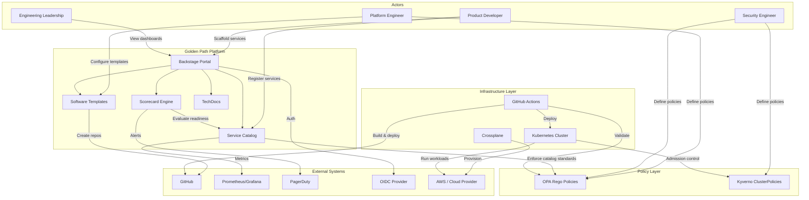

# System Context

> **Architecture Document** — Describes the Golden Path Platform's boundaries, external dependencies, and actors.
>
> Related ADR: [ADR-0001: Use Backstage as the Developer Portal](../adr/0001-backstage-developer-portal.md)

---

## Purpose

The System Context diagram defines the Golden Path Platform's boundaries —
what the system does, who uses it, and what external systems it depends on.
This is the highest-level architecture view, equivalent to Level 1 in the
C4 model.

---

## System Context Diagram



---

## Actors

### Product Developer

The primary consumer of the platform. Product developers use the platform to:

- Scaffold new services from golden path templates
- Register existing services in the catalog
- Provision infrastructure via Crossplane claims
- View service health and dependencies
- Access operational documentation via TechDocs

**Key files consumed**: `templates/`, `catalog/`, `infra/crossplane/`, `examples/services/`

### Platform Engineer

The builder and maintainer of the platform. Platform engineers:

- Author and maintain software templates in `templates/`
- Configure Backstage application in `app/backstage/`
- Maintain catalog entities in `catalog/`
- Develop Crossplane Compositions for infrastructure claims
- Operate the Backstage application and its backing services

**Key files maintained**: `app/backstage/`, `templates/`, `infra/crossplane/`, `scripts/`

### Security Engineer

Defines and enforces security policies across the platform:

- Author OPA Rego policies in `policies/opa/`
- Author Kyverno ClusterPolicies in `policies/kyverno/`
- Review service catalog entries for compliance
- Define data classification and security review requirements

**Key files maintained**: `policies/opa/`, `policies/kyverno/`

### Engineering Leadership

Consumes platform data for decision-making:

- View service ownership and health via Backstage dashboards
- Monitor production readiness scorecard trends
- Track adoption metrics across teams
- Review architecture decision records

**Key files consumed**: `docs/adr/`, `docs/diagrams/`, scorecard reports

---

## System Boundaries

### What's Inside the Platform

| Component | Location | Responsibility |
|-----------|----------|----------------|
| Backstage Portal | `app/backstage/` | Developer interface, catalog, templates, TechDocs |
| Service Catalog | `catalog/` | Central registry of all entities |
| Software Templates | `templates/` | Scaffolding logic for new services/docs |
| Policy Engine | `policies/` | OPA + Kyverno policy definitions |
| Scorecard Engine | `scripts/scorecard.py` | Production readiness evaluation |
| Catalog Validator | `scripts/validate-catalog.py` | Schema validation for catalog entities |
| Infrastructure Manifests | `infra/k8s/` | Reference Kubernetes manifests |
| Crossplane Claims | `infra/crossplane/` | Self-service infrastructure provisioning |
| CI/CD Pipeline | `.github/workflows/ci.yml` | Automated build, test, validation |

### What's Outside the Platform (External Dependencies)

| External System | Integration Point | Purpose |
|----------------|-------------------|---------|
| **GitHub** | Git API, Actions | Source code hosting, CI/CD execution |
| **Kubernetes** | API Server | Container orchestration, workload scheduling |
| **AWS** | Crossplane Providers | Cloud infrastructure (RDS, S3, SQS) |
| **OIDC Provider** | OAuth2/OIDC | Developer authentication |
| **Prometheus/Grafana** | Metrics API | Monitoring and observability |
| **PagerDuty** | REST API | Incident management and alerting |

---

## Data Flow Summary

### Inbound Flows (Who Sends Data to the Platform)

1. **Developers** → Submit scaffolding requests through Backstage UI
2. **Developers** → Push `catalog-info.yaml` changes via Git
3. **Platform Engineers** → Update templates, policies, and configurations via Git
4. **Security Engineers** → Author policy changes via Git PRs
5. **GitHub Actions** → Report CI/CD results and validation outcomes

### Outbound Flows (Who Receives Data from the Platform)

1. **Platform → GitHub**: Create repositories for new services
2. **Platform → Kubernetes**: Deploy workloads, apply admission policies
3. **Platform → Cloud Provider**: Provision infrastructure via Crossplane
4. **Platform → Monitoring**: Export metrics, dashboards, and alerts
5. **Platform → Developers**: Provide service discovery, docs, and health status

---

## External System Integration Details

### GitHub Integration

- **Purpose**: Source code hosting, CI/CD execution, team management
- **Integration**: Backstage GitHub plugin, GitHub Actions
- **Data flow**: Bidirectional — platform reads repos, creates repos
- **Authentication**: GitHub App or Personal Access Token
- **Configuration**: `AUTH_GITHUB_CLIENT_ID`, `CATALOG_GITHUB_ORG` in `.env`

### Kubernetes Integration

- **Purpose**: Container orchestration, workload scheduling, admission control
- **Integration**: Backstage Kubernetes plugin, Kyverno webhooks
- **Data flow**: Platform reads cluster state, applies manifests
- **Authentication**: ServiceAccount token or kubeconfig
- **Configuration**: `KUBERNETES_CLUSTER_NAME`, `KUBECONFIG` in `.env`

### AWS Integration

- **Purpose**: Cloud infrastructure provisioning (RDS, S3, SQS)
- **Integration**: Crossplane AWS providers
- **Data flow**: Platform provisions resources via Crossplane Claims
- **Authentication**: IAM roles or access keys via Crossplane provider config
- **Configuration**: Crossplane provider configuration (not in this repo)

### Monitoring Integration

- **Purpose**: Observability, alerting, incident management
- **Integration**: Grafana dashboards, PagerDuty services
- **Data flow**: Platform links to external monitoring; does not operate it
- **Authentication**: Pre-configured in monitoring tools
- **Configuration**: Links in catalog entity annotations

---

## Security Boundary

The platform enforces security through multiple layers:

```mermaid
graph LR
    subgraph "Developer Workstation"
        GIT[Git Client]
    end

    subgraph "Platform Boundary"
        BS2[Backstage]
        OPA2[OPA]
        KYV2[Kyverno]
        CP2[Crossplane]
    end

    subgraph "Production Boundary"
        K8S2[Kubernetes]
        CLOUD2[Cloud Resources]
    end

    GIT -->|Authenticated push| BS2
    BS2 -->|Policy evaluation| OPA2
    K8S2 -->|Admission webhook| KYV2
    CP2 -->|Provisioning| CLOUD2

    style "Platform Boundary" fill:#fef3c7,stroke:#d97706
    style "Production Boundary" fill:#fee2e2,stroke:#dc2626
```

### Trust Boundaries

| Boundary | Trust Level | Enforcement |
|----------|-------------|-------------|
| Developer Workstation | Low | Git authentication, branch protection |
| Platform (Backstage) | Medium | OIDC authentication, RBAC |
| Policy Engine (OPA) | High | Evaluated in CI and catalog refresh |
| Kubernetes (Kyverno) | High | Admission control webhook |
| Cloud Resources | Critical | IAM, encryption, network policies |

---

## Decision References

| Decision | ADR | Status |
|----------|-----|--------|
| Use Backstage as developer portal | [ADR-0001](../adr/0001-backstage-developer-portal.md) | Accepted |
| Catalog as platform control plane | [ADR-0002](../adr/0002-catalog-as-platform-control-plane.md) | Accepted |
| Policy-gated golden paths | [ADR-0003](../adr/0003-policy-gated-golden-paths.md) | Accepted |
| Crossplane claims for infra | [ADR-0004](../adr/0004-crossplane-claims.md) | Accepted |

---

## Related Documents

- [Platform Operating Model](platform-operating-model.md) — Team structure and interaction patterns
- [Service Catalog Model](service-catalog-model.md) — Entity hierarchy and relationships
- [Policy Gates](policy-gates.md) — OPA + Kyverno enforcement details
- [Crossplane Abstractions](crossplane-abstractions.md) — Infrastructure claim model
