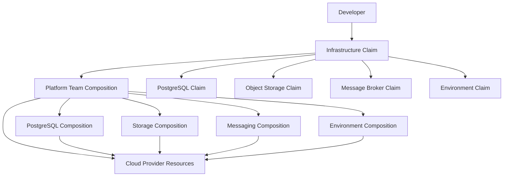
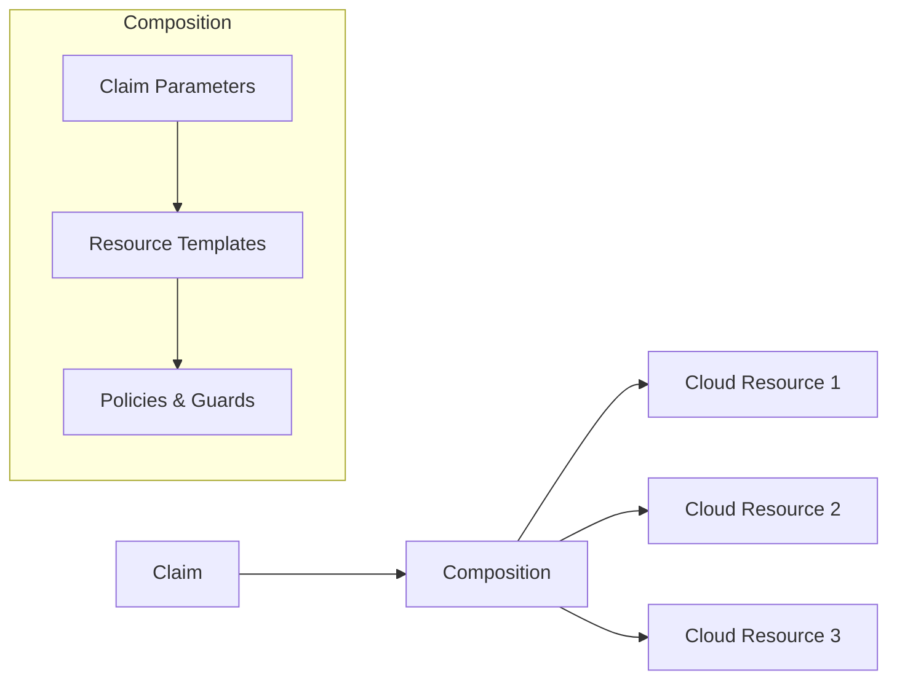

# Crossplane Abstractions Architecture

## Overview

Crossplane provides infrastructure-as-code through Kubernetes-native resource claims. This platform uses Crossplane to enable self-service infrastructure provisioning while maintaining governance through compositions and policies.

## Abstraction Model



## Claim Types

### PostgreSQL Claim

Location: `infra/crossplane/postgresql-claim.yaml`

```yaml
apiVersion: database.crossplane.io/v1beta1
kind: PostgreSQLInstance
metadata:
  name: commerce-postgres
  namespace: commerce-platform
spec:
  compositionSelector:
    matchLabels:
      provider: aws
      tier: standard
  parameters:
    storageGB: 100
    engine: postgres
    engineVersion: "15"
    size: medium
  claimRef:
    namespace: commerce-platform
    name: commerce-postgres
```

### Object Storage Bucket Claim

Location: `infra/crossplane/bucket-claim.yaml`

```yaml
apiVersion: objectstorage.crossplane.io/v1beta1
kind: Bucket
metadata:
  name: commerce-assets
  namespace: commerce-platform
spec:
  compositionSelector:
    matchLabels:
      provider: aws
  parameters:
    name: commerce-assets-prod
    region: us-east-1
    encryption:
      enabled: true
      sseAlgorithm: AES256
```

### Message Broker Claim

Location: `infra/crossplane/message-broker-claim.yaml`

```yaml
apiVersion: messaging.crossplane.io/v1beta1
kind: Broker
metadata:
  name: commerce-events
  namespace: commerce-platform
spec:
  compositionSelector:
    matchLabels:
      provider: aws
  parameters:
    engine: rabbitmq
    plan: standard
    connections:
      max: 100
```

### Environment Claim

Location: `infra/crossplane/environment-claim.yaml`

The environment claim is a higher-level abstraction that composes multiple resources:

```yaml
apiVersion: platform.crossplane.io/v1alpha1
kind: Environment
metadata:
  name: commerce-dev
  namespace: commerce-platform
spec:
  compositionSelector:
    matchLabels:
      environment: development
  parameters:
    name: commerce-dev
    tier: development
    resources:
      database:
        enabled: true
        size: small
      storage:
        enabled: true
        encryption: true
      messaging:
        enabled: true
        plan: basic
```

## Composition Pattern

Compositions are platform-team-managed templates that define how claims map to cloud resources:



### Composition Responsibilities

1. **Resource Mapping**: Translate claim parameters to cloud-specific configurations
2. **Policy Enforcement**: Apply security, compliance, and cost policies
3. **Lifecycle Management**: Handle provisioning, updates, and deprovisioning
4. **Cross-Resource Dependencies**: Manage dependencies between resources

## Integration with Platform

### Template Integration

Software templates can include Crossplane claims as part of the scaffolding process:

```yaml
steps:
  - id: fetch-template
    name: Fetching template
    action: fetch:repo
    input:
      url: ./skeleton
  
  - id: create-infrastructure
    name: Creating infrastructure claims
    action: fetch:plain
    input:
      content: |
        apiVersion: database.crossplane.io/v1beta1
        kind: PostgreSQLInstance
        metadata:
          name: ${{ parameters.name }}-db
        spec:
          parameters:
            storageGB: ${{ parameters.storageSize | default('50') }}
```

### Catalog Integration

Crossplane resources are registered in the Backstage catalog:

```yaml
apiVersion: backstage.io/v1alpha1
kind: Resource
metadata:
  name: commerce-postgres
  annotations:
    crossplane.io/claim-name: commerce-postgres
    crossplane.io/claim-namespace: commerce-platform
spec:
  type: database
  owner: team-platform
  system: commerce-platform
```

## Governance

### Resource Quotas

- Maximum storage per claim: 1TB
- Maximum compute per claim: 8 vCPU, 32GB RAM
- Maximum claims per team: 20

### Cost Management

- Claims include cost estimation annotations
- Monthly cost reports generated from Crossplane metrics
- Budget alerts triggered at 80% threshold

### Compliance

- All resources tagged with team, environment, and cost center
- Encryption required for data at rest
- Network policies enforced at composition level

## Local Development

For local development, Crossplane claims can be satisfied using:

1. **Localstack**: AWS service emulation
2. **Kind**: Kubernetes-in-Docker with local volumes
3. **Docker Compose**: Direct container provisioning

```bash
# Test claims locally
kubectl apply -f infra/crossplane/postgresql-claim.yaml
kubectl get postgresqlinstances -n commerce-platform
```
