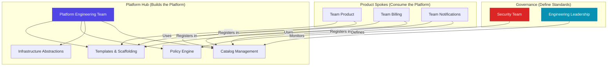
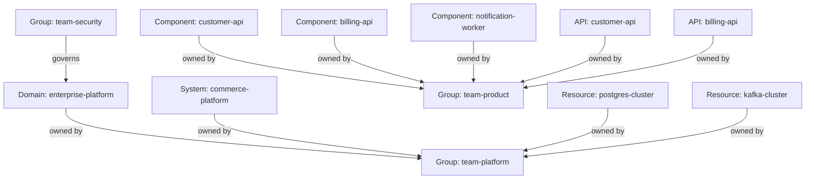
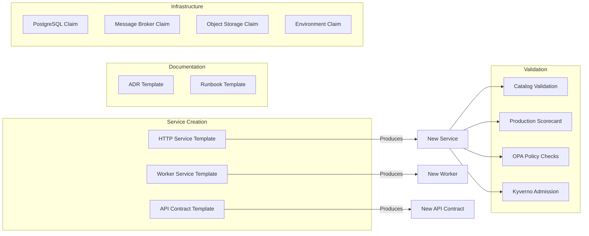
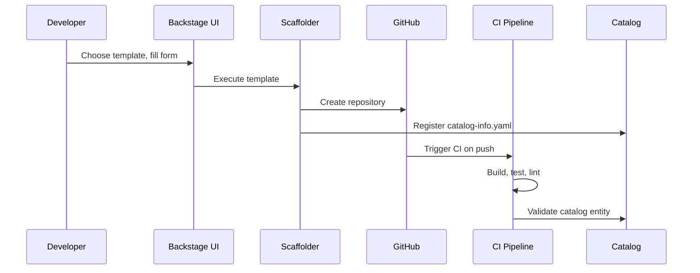
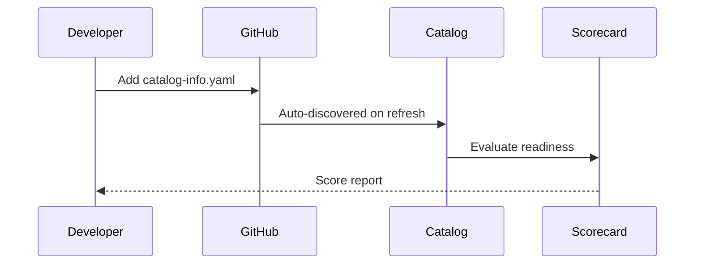
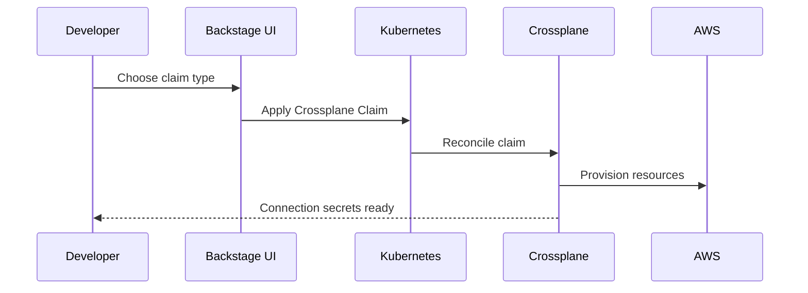
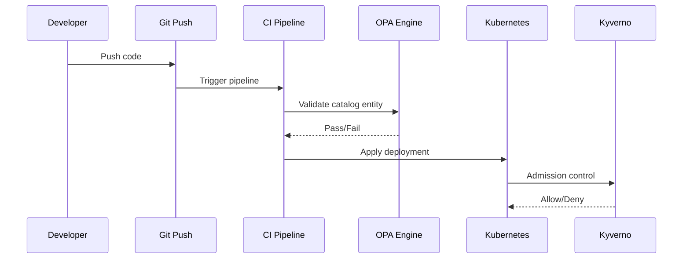

# Platform Operating Model

> **Architecture Document** — Describes team structure, ownership patterns, and how teams interact with the Golden Path Platform.
>
> Related ADR: [ADR-0001: Use Backstage as the Developer Portal](../adr/0001-backstage-developer-portal.md) | [ADR-0002: Catalog as Platform Control Plane](../adr/0002-catalog-as-platform-control-plane.md)

---

## Purpose

The Platform Operating Model defines **who owns what**, **how teams interact
with the platform**, and **what the golden paths are** for common workflows.
This document establishes the organizational contracts that make the platform
sustainable at scale.

---

## Team Structure

The platform operates on a **hub-and-spoke** model with three distinct team
categories:

### Team Roles and Responsibilities

#### Platform Engineering Team

| Area | Responsibility | Files |
|------|---------------|-------|
| Backstage Application | Install, configure, upgrade Backstage | `app/backstage/` |
| Software Templates | Author and maintain scaffolding templates | `templates/` |
| Catalog Management | Define catalog schema, validate entities | `catalog/`, `scripts/validate-catalog.py` |
| Scorecard | Define and maintain readiness checks | `scripts/scorecard.py` |
| Infrastructure Abstractions | Author Crossplane Compositions and Claims | `infra/crossplane/` |
| Kubernetes Manifests | Maintain reference deployment patterns | `infra/k8s/` |
| CI/CD | Maintain the platform's own CI pipeline | `.github/workflows/ci.yml` |

**Size**: 5-8 engineers (typical)
**Cadence**: Platform releases every 2 weeks; template/policy updates as needed

#### Product Development Teams

| Area | Responsibility | Files |
|------|---------------|-------|
| Application Code | Build and maintain business logic | Service repositories |
| Catalog Registration | Maintain `catalog-info.yaml` in their repos | `catalog/service-*.yaml` |
| Scorecard Compliance | Achieve and maintain score ≥ 80/100 | N/A (consumed via Backstage) |
| Operational Runbooks | Create and maintain runbooks per service | `docs/runbooks/` |
| Monitoring | Configure dashboards and alerts | N/A (external tools) |

**Size**: 5-10 engineers per team (typical)
**Cadence**: Continuous delivery; production promotions as needed

#### Security Team

| Area | Responsibility | Files |
|------|---------------|-------|
| OPA Policies | Define catalog compliance policies | `policies/opa/` |
| Kyverno Policies | Define Kubernetes admission policies | `policies/kyverno/` |
| Data Classification | Define and enforce classification standards | `policies/opa/require_data_classification.rego` |
| Security Reviews | Review public-facing services | `policies/opa/reject_public_no_security.rego` |

**Size**: 2-4 engineers (typical)
**Cadence**: Monthly policy reviews; new policies as standards evolve

#### Engineering Leadership

| Area | Responsibility | Approach |
|------|---------------|----------|
| Adoption Metrics | Track template usage and catalog coverage | Backstage dashboards |
| Readiness Trends | Monitor scorecard results over time | Scorecard reports |
| Architecture Decisions | Review and approve ADRs | `docs/adr/` |
| Investment Decisions | Decide platform expansion priorities | Quarterly reviews |

**Size**: 1-3 leaders (typical)
**Cadence**: Monthly platform review meetings

---

## Ownership Model

Every entity in the catalog must have a clear owner. Ownership is defined at
multiple levels:

### Ownership Hierarchy

### Ownership Rules

1. **Every entity must have an owner** — enforced by `policies/opa/require_owner.rego`
2. **Owner must be a registered Group** — the `spec.owner` field references a Group entity
3. **Ownership is explicit** — no implicit or inherited ownership
4. **Ownership is versioned** — changes tracked via Git history

### Ownership Transfers

When a service changes teams:

1. Update `spec.owner` in `catalog-info.yaml`
2. Update corresponding annotations (PagerDuty, Grafana)
3. Update CI/CD ownership (GitHub CODEOWNERS)
4. Notify affected stakeholders
5. Record the transfer in the service's ADR history

---

## Golden Paths

Golden paths are standardized workflows that make the right thing the easy thing.
They are paved roads with guardrails, not rigid requirements.

### Golden Path Principles

| Principle | Description | Example |
|-----------|-------------|---------|
| **Paved, not mandated** | Default path, not only path | Templates are available but not required |
| **Guardrails, not gates** | Early feedback, not blocking | OPA warns in CI, doesn't block PR merge initially |
| **Self-service** | No tickets required | Crossplane Claims provision infra in minutes |
| **Opinionated defaults** | Sensible choices pre-configured | Node.js + Express, TypeScript, Jest |
| **Escape hatches** | Can deviate when needed | Custom catalog-info.yaml, manual infra |

### Golden Path Inventory

| Golden Path | Entry Point | What It Produces |
|-------------|-------------|------------------|
| HTTP Service | `templates/new-http-service/` | Express app, catalog-info.yaml, CI pipeline, runbook |
| Worker Service | `templates/new-worker-service/` | Event-driven worker, catalog-info.yaml, CI pipeline |
| API Contract | `templates/new-api-contract/` | OpenAPI spec, catalog-info.yaml, runbook |
| ADR | `templates/new-adr/` | Architecture Decision Record |
| Runbook | `templates/new-runbook/` | Operational runbook |
| PostgreSQL | `infra/crossplane/postgresql-claim.yaml` | AWS RDS PostgreSQL instance |
| Message Broker | `infra/crossplane/message-broker-claim.yaml` | RabbitMQ/SQS message broker |
| Object Storage | `infra/crossplane/bucket-claim.yaml` | S3 bucket with encryption |
| Environment | `infra/crossplane/environment-claim.yaml` | Composite: DB + Storage + Broker |

---

## Interaction Patterns

### Pattern 1: Create a New Service

**Time**: 10-15 minutes from idea to running CI pipeline

### Pattern 2: Register an Existing Service

**Time**: 15-30 minutes to register and validate

### Pattern 3: Provision Infrastructure

**Time**: 5-15 minutes for infrastructure provisioning

### Pattern 4: Policy Enforcement

---

## Communication Channels

| Channel | Purpose | Frequency |
|---------|---------|-----------|
| `#platform-engineering` | Platform team internal coordination | Daily |
| `#platform-announce` | Platform updates and releases | Weekly digest |
| `#platform-support` | Developer questions and support | As needed |
| Architecture Reviews | ADR reviews and platform decisions | Bi-weekly |
| Platform Review | Leadership review of metrics and adoption | Monthly |

---

## Metrics and KPIs

| Metric | Target | Measurement |
|--------|--------|-------------|
| Time to first deploy (new service) | < 10 minutes | Template creation → CI passing |
| Catalog coverage | > 90% of services registered | Registered / total services |
| Scorecard pass rate | > 85% of entities score ≥ 80 | Scorecard reports |
| Policy compliance | 100% of production services pass OPA | OPA evaluation results |
| Infrastructure self-service | > 80% of infra via Crossplane Claims | Claims / total infra |
| Developer satisfaction | > 4.0/5.0 | Quarterly survey |

---

## Scaling Considerations

### At 10 Teams / 50 Services

- Single platform team (5 engineers)
- All catalog entities in one `catalog/` directory
- Simple policy set (5-8 OPA policies)
- 2-3 Crossplane claim types

### At 30 Teams / 200 Services

- Dedicated platform team (8 engineers)
- Per-team Location entities for catalog registration
- Expanded policy set (12-15 OPA policies)
- 5-7 Crossplane claim types
- Dedicated on-call rotation for platform support

### At 100+ Teams / 1000+ Services

- Platform platform-as-a-product with dedicated leadership
- Backstage multi-tenancy or separate instances
- Policy-as-a-service with self-service policy authoring
- Crossplane compositions per team with customization
- Dedicated SRE team for platform reliability

---

## Decision References

| Decision | ADR | Relevance |
|----------|-----|-----------|
| Backstage as developer portal | [ADR-0001](../adr/0001-backstage-developer-portal.md) | Defines the primary interface |
| Catalog as control plane | [ADR-0002](../adr/0002-catalog-as-platform-control-plane.md) | Defines ownership and metadata model |
| Policy-gated golden paths | [ADR-0003](../adr/0003-policy-gated-golden-paths.md) | Defines enforcement model |
| Crossplane claims | [ADR-0004](../adr/0004-crossplane-claims.md) | Defines infrastructure abstraction |

---

## Related Documents

- [System Context](context.md) — Platform boundaries and external dependencies
- [Service Catalog Model](service-catalog-model.md) — Entity hierarchy and relationships
- [Software Template Model](software-template-model.md) — Template anatomy and scaffolder flow
- [Production Readiness](production-readiness.md) — Scorecard model
- [Policy Gates](policy-gates.md) — OPA + Kyverno enforcement details
- [Crossplane Abstractions](crossplane-abstractions.md) — Infrastructure claim model
