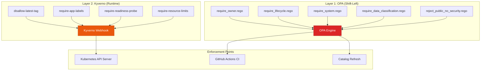
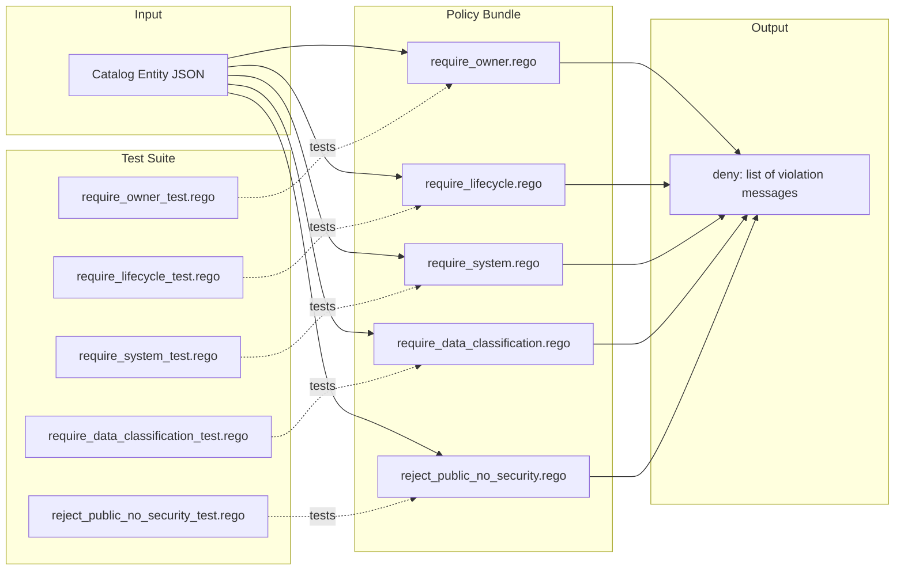
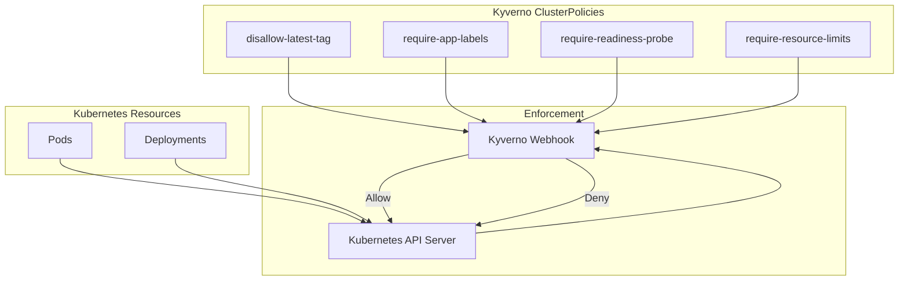
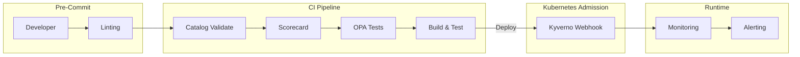
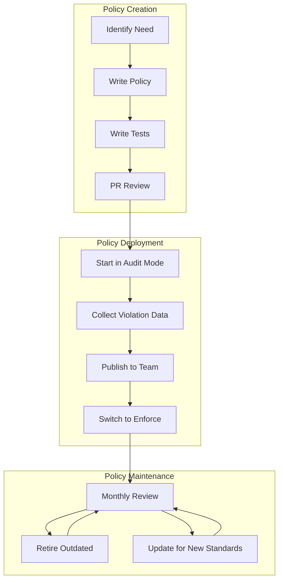

# Policy Gates

> **Architecture Document** — Describes the two-layer policy enforcement model using OPA (Open Policy Agent) for catalog policies and Kyverno for Kubernetes admission control.
>
> Related ADR: [ADR-0003: Policy-Gated Golden Paths Using OPA + Kyverno](../adr/0003-policy-gated-golden-paths.md)

---

## Purpose

Policy gates ensure that all services, catalog entries, and Kubernetes deployments
comply with organizational standards. The Golden Path Platform uses a **two-layer
enforcement model**: OPA for catalog and application-level policies, and Kyverno
for Kubernetes runtime admission control.

---

## Two-Layer Policy Model



### Why Two Layers?

| Concern | OPA | Kyverno |
|---------|-----|---------|
| **Evaluates** | Catalog entities, application configs | Kubernetes resources |
| **When** | CI pipeline, catalog refresh | Kubernetes admission |
| **Language** | Rego | YAML patterns |
| **Scope** | Platform-wide metadata standards | Runtime deployment standards |
| **Failure Mode** | CI failure, catalog rejection | Pod creation blocked |

---

## Layer 1: OPA Policies

### OPA Policy Architecture



### Policy 1: Require Owner

**File**: `policies/opa/require_owner.rego`
**Test**: `policies/opa/require_owner_test.rego`

**Rule**: All catalog entities must have a non-empty `spec.owner`.

```rego
package policies.catalog.require_owner

default deny := false

deny[msg] {
    entity := input.entity
    not has_owner(entity)
    msg := sprintf("Entity '%s' is missing required 'owner' field", [entity.metadata.name])
}

has_owner(entity) {
    entity.spec.owner != ""
}
```

**Violation**: `Entity 'my-service' is missing required 'owner' field`

### Policy 2: Require Lifecycle

**File**: `policies/opa/require_lifecycle.rego`
**Test**: `policies/opa/require_lifecycle_test.rego`

**Rule**: All entities must have a lifecycle restricted to `experimental`, `production`, or `deprecated`.

```rego
package policies.catalog.require_lifecycle

default deny := false
allowed_lifecycles := {"experimental", "production", "deprecated"}

deny[msg] {
    entity := input.entity
    not has_lifecycle(entity)
    msg := sprintf("Entity '%s' is missing required 'lifecycle' field", [entity.metadata.name])
}

deny[msg] {
    entity := input.entity
    lifecycle := entity.spec.lifecycle
    not lifecycle in allowed_lifecycles
    msg := sprintf("Entity '%s' has invalid lifecycle '%s'. Allowed values: %s", [
        entity.metadata.name,
        lifecycle,
        concat(", ", allowed_lifecycles),
    ])
}
```

**Violations**:
- `Entity 'my-service' is missing required 'lifecycle' field`
- `Entity 'my-service' has invalid lifecycle 'staging'. Allowed values: experimental, production, deprecated`

### Policy 3: Require System

**File**: `policies/opa/require_system.rego`
**Test**: `policies/opa/require_system_test.rego`

**Rule**: All Component and Service entities must have a `spec.system` defined.

```rego
package policies.catalog.require_system

default deny := false

deny[msg] {
    entity := input.entity
    is_component_or_service(entity)
    not has_system(entity)
    msg := sprintf("Entity '%s' of kind '%s' is missing required 'system' field", [
        entity.metadata.name,
        entity.kind,
    ])
}

is_component_or_service(entity) { entity.kind == "Component" }
is_component_or_service(entity) { entity.kind == "Service" }

has_system(entity) {
    entity.spec.system != ""
}
```

**Violation**: `Entity 'my-api' of kind 'Component' is missing required 'system' field`

### Policy 4: Require Data Classification

**File**: `policies/opa/require_data_classification.rego`
**Test**: `policies/opa/require_data_classification_test.rego`

**Rule**: All Service entities must have a `data.classification` annotation.

```rego
package policies.catalog.require_data_classification

default deny := false

deny[msg] {
    entity := input.entity
    entity.kind == "Service"
    not has_data_classification(entity)
    msg := sprintf("Service '%s' is missing required annotation 'data.classification'", [
        entity.metadata.name,
    ])
}

has_data_classification(entity) {
    entity.metadata.annotations["data.classification"]
}
```

**Violation**: `Service 'payment-api' is missing required annotation 'data.classification'`

### Policy 5: Reject Public Without Security Review

**File**: `policies/opa/reject_public_no_security.rego`
**Test**: `policies/opa/reject_public_no_security_test.rego`

**Rule**: Services marked as public (`spec.public: true`) must have a `security.review` annotation.

```rego
package policies.catalog.reject_public_no_security

default deny := false

deny[msg] {
    entity := input.entity
    entity.kind == "Service"
    is_public(entity)
    not has_security_review(entity)
    msg := sprintf("Service '%s' is marked as public but is missing required annotation 'security.review'", [
        entity.metadata.name,
    ])
}

is_public(entity) { entity.spec.public == true }

has_security_review(entity) {
    entity.metadata.annotations["security.review"]
}
```

**Violation**: `Service 'public-api' is marked as public but is missing required annotation 'security.review'`

---

## OPA Testing

### Running Tests Locally

```bash
# Run all OPA tests
make policy-test

# Direct OPA command
opa test policies/opa/ -v

# Check policy formatting
opa fmt policies/opa/ --diff
```

### Test Structure

Each `_test.rego` file contains test cases that verify policy behavior:

```rego
# Example from require_owner_test.rego
test_deny_entity_without_owner {
    deny with input as {
        "entity": {
            "metadata": {"name": "test-service"},
            "spec": {"owner": ""}
        }
    }
}

test_allow_entity_with_owner {
    count(deny) == 0 with input as {
        "entity": {
            "metadata": {"name": "test-service"},
            "spec": {"owner": "team-product"}
        }
    }
}
```

### CI Integration

OPA tests run in GitHub Actions as the `policy-syntax` job:

```yaml
policy-syntax:
  name: OPA Policy Syntax Check
  runs-on: ubuntu-latest
  steps:
    - uses: actions/checkout@v4
    - name: Setup OPA
      uses: open-policy-agent/setup-opa@v2
      with:
        version: latest
    - name: Check policy syntax
      run: opa fmt policies/opa/ --diff || echo "⚠️ Policy formatting issues"
    - name: Run OPA policy tests
      run: opa test policies/opa/ -v
```

---

## Layer 2: Kyverno Policies

### Kyverno Policy Architecture



### Kyverno Policy 1: Disallow Latest Tag

**File**: `policies/kyverno/disallow-latest-tag.yaml`
**Severity**: Medium
**Action**: Enforce

**Rule**: Images must not use the `:latest` tag. Use pinned versions instead.

```yaml
apiVersion: kyverno.io/v1
kind: ClusterPolicy
metadata:
  name: disallow-latest-tag
  annotations:
    policies.kyverno.io/title: Disallow Latest Tag
    policies.kyverno.io/severity: medium
spec:
  validationFailureAction: Enforce
  background: true
  rules:
    - name: disallow-latest-image-tag
      match:
        any:
          - resources:
              kinds:
                - Pod
      validate:
        message: >-
          Using the 'latest' tag is disallowed. Image '{{ element.image }}'
          must use a pinned version tag or digest.
        pattern:
          spec:
            containers:
              - name: "*"
                image: "!*:latest"
```

**Example Violation**:
```
Using the 'latest' tag is disallowed. Image 'myregistry/myapp:latest'
must use a pinned version tag or digest.
```

### Kyverno Policy 2: Require App Labels

**File**: `policies/kyverno/require-app-labels.yaml`
**Severity**: Medium
**Action**: Enforce

**Rule**: Deployments must have `app.kubernetes.io/name` and `app.kubernetes.io/owner` labels.

```yaml
rules:
  - name: require-app-name-label
    match:
      any:
        - resources:
            kinds:
              - Deployment
            operations: [CREATE, UPDATE]
    validate:
      message: >-
        Deployment '{{ request.object.metadata.name }}' must have
        label 'app.kubernetes.io/name' defined.
      pattern:
        metadata:
          labels:
            app.kubernetes.io/name: "?*"
  - name: require-app-owner-label
    match:
      any:
        - resources:
            kinds:
              - Deployment
            operations: [CREATE, UPDATE]
    validate:
      message: >-
        Deployment '{{ request.object.metadata.name }}' must have
        label 'app.kubernetes.io/owner' defined.
      pattern:
        metadata:
          labels:
            app.kubernetes.io/owner: "?*"
```

### Kyverno Policy 3: Require Readiness Probe

**File**: `policies/kyverno/require-readiness-probe.yaml`
**Severity**: Medium
**Action**: Enforce

**Rule**: All containers in Deployments must have a `readinessProbe` defined.

```yaml
rules:
  - name: check-readiness-probe
    match:
      any:
        - resources:
            kinds:
              - Deployment
            operations: [CREATE, UPDATE]
    validate:
      message: >-
        Container '{{ element.name }}' in Deployment
        '{{ request.object.metadata.name }}' must have a readinessProbe defined.
      pattern:
        spec:
          template:
            spec:
              containers:
                - name: "*"
                  readinessProbe:
                    "?*": "?*"
```

### Kyverno Policy 4: Require Resource Limits

**File**: `policies/kyverno/require-resource-limits.yaml`
**Severity**: Medium
**Action**: Enforce

**Rule**: All containers must have CPU and memory limits defined.

```yaml
rules:
  - name: check-container-resources
    match:
      any:
        - resources:
            kinds:
              - Pod
    validate:
      message: >-
        Container '{{ element.name }}' must have cpu and memory resource limits defined.
      pattern:
        spec:
          containers:
            - name: "*"
              resources:
                limits:
                  cpu: "?*"
                  memory: "?*"
```

---

## Policy Enforcement Points



### Enforcement Timing

| Phase | Policy Engine | What It Checks | Failure Mode |
|-------|-------------|----------------|--------------|
| **CI (Pre-merge)** | OPA | Catalog entity validity, metadata completeness | PR blocked |
| **CI (Post-merge)** | OPA + Scorecard | Full policy validation, readiness score | Deployment blocked |
| **K8s Admission** | Kyverno | Pod/Deployment compliance | Pod creation denied |
| **Runtime** | Monitoring | Health, SLOs, anomaly detection | Alerts triggered |

---

## Policy Violation Handling

### For OPA Violations

1. **Read the violation message** — it describes what's missing
2. **Fix the catalog-info.yaml** — add the missing field or annotation
3. **Validate locally** — run `make catalog-validate`
4. **Test OPA** — run `make policy-test`
5. **Push and verify** — CI should now pass

### For Kyverno Violations

1. **Check pod events** — `kubectl describe pod <name>`
2. **Read the admission denial message** — it describes what's missing
3. **Fix the deployment manifest** — add labels, probes, or resource limits
4. **Redeploy** — Kyverno should now allow the deployment

---

## Policy Lifecycle



### Progressive Enforcement

New policies should follow this progression:

| Phase | Mode | Duration | Purpose |
|-------|------|----------|---------|
| **Draft** | `audit` | 2-4 weeks | Collect violation data without blocking |
| **Review** | `audit` | 1-2 weeks | Publish data, notify teams, gather feedback |
| **Enforce** | `enforce` | Ongoing | Block non-compliant resources |

---

## Adding New Policies

### OPA Policy

1. Create `policies/opa/your_policy.rego`
2. Create `policies/opa/your_policy_test.rego`
3. Test locally: `opa test policies/opa/ -v`
4. Add to CI pipeline (automatic if in `policies/opa/`)
5. Document in this file

### Kyverno Policy

1. Create `policies/kyverno/your-policy.yaml`
2. Apply to cluster: `kubectl apply -f policies/kyverno/your-policy.yaml`
3. Test with a violating resource
4. Monitor `kyverno-reports` for violations
5. Document in this file

---

## Related Documents

- [ADR-0003: Policy-Gated Golden Paths](../adr/0003-policy-gated-golden-paths.md) — Decision rationale
- [Production Readiness](production-readiness.md) — How scorecard complements policy gates
- [Service Catalog Model](service-catalog-model.md) — What OPA validates
- [Platform Operating Model](platform-operating-model.md) — Who defines and maintains policies
- [policies/opa/](../../policies/opa/) — OPA policy source files
- [policies/kyverno/](../../policies/kyverno/) — Kyverno policy source files
