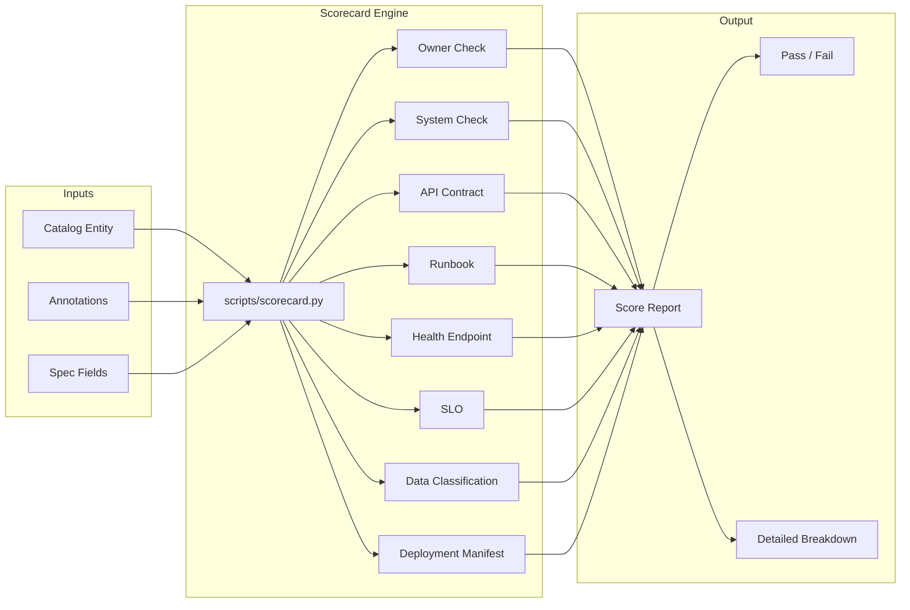
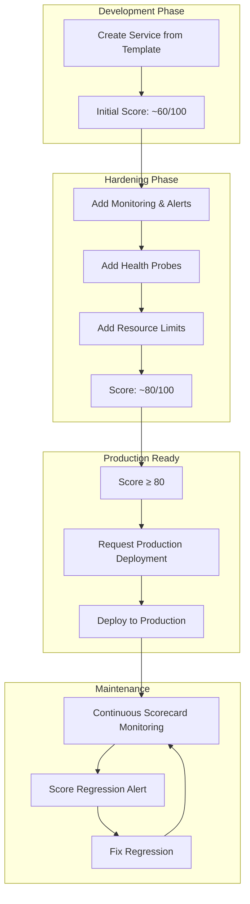
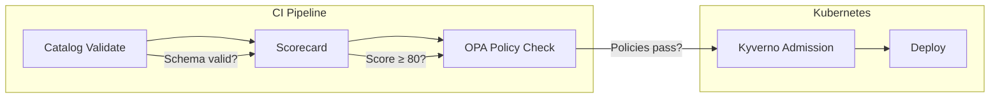

# Production Readiness

> **Architecture Document** — Describes the 10-point production readiness scorecard model, how it evaluates services, and how teams achieve and maintain readiness.
>
> Related: [Runbook: Fix Scorecard Failures](../runbooks/fix-scorecard-failure.md) | [scripts/scorecard.py](../../scripts/scorecard.py)

---

## Purpose

The Production Readiness Scorecard provides an **objective, automated measure**
of whether a service is ready for production traffic. It replaces subjective
assessments ("I think it's ready") with measurable criteria that can be tracked
over time.

---

## Scorecard Overview



---

## The 10 Production Readiness Checks

| # | Check | Points | Source | What It Validates |
|---|-------|--------|--------|-------------------|
| 1 | Owner defined | 10 | `metadata.annotations.backstage.io/owner` or `metadata.owner` | Service has a clear, accountable owner |
| 2 | System defined | 10 | `spec.system` or `backstage.io/techdocs-ref` | Service belongs to a logical system grouping |
| 3 | API contract present | 10 | `spec.apis` or `backstage.io/api-contract` annotation | Service has a defined API contract |
| 4 | Runbook present | 10 | `backstage.io/runbook-url` annotation or `metadata.links` | Operational documentation exists |
| 5 | Health endpoint declared | 10 | `backstage.io/health-endpoint` or `spec.healthcheck` | Service declares how to check its health |
| 6 | SLO declared | 10 | `backstage.io/slo` or `spec.slo` | Service has defined reliability targets |
| 7 | Data classification declared | 10 | `backstage.io/data-classification` or `metadata.tags` | Data sensitivity level is documented |
| 8 | Deployment manifest present | 10 | `backstage.io/deployment-manifest` or `spec.lifecycle` | Deployment configuration exists |
| **Total** | | **80** | | **Target: ≥ 80/100** |

> **Note**: The scorecard evaluates 8 checks per entity. Each check contributes
> 10 points. The target score is ≥ 80 (all checks pass). The 100-point target
> can be achieved by adding supplementary annotations and configurations.

---

## Check Implementation Details

### Check 1: Owner Defined (10 points)

**Detection Logic**:
```python
lambda d: bool(
    d.get("metadata", {}).get("annotations", {}).get("backstage.io/owner", "")
    or d.get("metadata", {}).get("owner")
)
```

**What Passes**:
- `metadata.annotations.backstage.io/owner: team-product` ✅
- `metadata.owner: team-platform` ✅
- `spec.owner: team-product` ✅

**What Fails**:
- No owner annotation or field ❌
- Empty owner value ❌

**Remediation**:
```yaml
metadata:
  annotations:
    backstage.io/owner: team-product
# OR
spec:
  owner: team-product
```

### Check 2: System Defined (10 points)

**Detection Logic**:
```python
lambda d: bool(
    d.get("metadata", {}).get("annotations", {}).get("backstage.io/techdocs-ref")
    or d.get("spec", {}).get("system")
)
```

**What Passes**:
- `spec.system: commerce-platform` ✅
- `backstage.io/techdocs-ref: dir:.` ✅

**Remediation**:
```yaml
spec:
  system: commerce-platform
```

### Check 3: API Contract Present (10 points)

**Detection Logic**:
```python
lambda d: bool(
    d.get("spec", {}).get("apis")
    or d.get("metadata", {}).get("annotations", {}).get("backstage.io/api-contract")
)
```

**What Passes**:
- `spec.apis: [customer-api]` ✅
- `backstage.io/api-contract: openapi.yaml` ✅

**Remediation**:
```yaml
spec:
  providesApis:
    - customer-api
```

### Check 4: Runbook Present (10 points)

**Detection Logic**:
```python
lambda d: bool(
    d.get("metadata", {}).get("annotations", {}).get("backstage.io/runbook-url")
    or d.get("metadata", {}).get("links", [])
)
```

**What Passes**:
- `backstage.io/runbook-url: https://...` ✅
- `metadata.links` with at least one link ✅

**Remediation**:
```yaml
metadata:
  annotations:
    backstage.io/runbook-url: https://docs.example.com/runbooks/my-service
# OR
  links:
    - url: https://grafana.example.com/d/my-service
      title: Grafana Dashboard
```

### Check 5: Health Endpoint Declared (10 points)

**Detection Logic**:
```python
lambda d: bool(
    d.get("metadata", {}).get("annotations", {}).get("backstage.io/health-endpoint")
    or d.get("spec", {}).get("healthcheck")
)
```

**What Passes**:
- `backstage.io/health-endpoint: /healthz` ✅
- `spec.healthcheck: { path: /healthz }` ✅

**Remediation**:
```yaml
metadata:
  annotations:
    backstage.io/health-endpoint: /healthz
```

### Check 6: SLO Declared (10 points)

**Detection Logic**:
```python
lambda d: bool(
    d.get("metadata", {}).get("annotations", {}).get("backstage.io/slo")
    or d.get("spec", {}).get("slo")
)
```

**What Passes**:
- `backstage.io/slo: 99.9% uptime` ✅
- `spec.slo: { availability: 99.9 }` ✅

### Check 7: Data Classification Declared (10 points)

**Detection Logic**:
```python
lambda d: bool(
    d.get("metadata", {}).get("annotations", {}).get("backstage.io/data-classification")
    or d.get("metadata", {}).get("tags", [])
)
```

**What Passes**:
- `backstage.io/data-classification: confidential` ✅
- `metadata.tags` with at least one tag ✅

**Remediation**:
```yaml
metadata:
  annotations:
    backstage.io/data-classification: confidential
  tags:
    - api
    - rest
```

### Check 8: Deployment Manifest Present (10 points)

**Detection Logic**:
```python
lambda d: bool(
    d.get("metadata", {}).get("annotations", {}).get("backstage.io/deployment-manifest")
    or d.get("spec", {}).get("lifecycle")
)
```

**What Passes**:
- `backstage.io/deployment-manifest: infra/k8s/deployment.yaml` ✅
- `spec.lifecycle: production` ✅

---

## Running the Scorecard

### Local Execution

```bash
# Via Makefile
make scorecard

# Direct execution
python3 scripts/scorecard.py
```

### CI Pipeline Execution

The scorecard runs automatically in CI via `.github/workflows/ci.yml`:

```yaml
scorecard:
  name: Production Readiness Scorecard
  runs-on: ubuntu-latest
  steps:
    - uses: actions/checkout@v4
    - name: Setup Python
      uses: actions/setup-python@v5
      with:
        python-version: "3.14"
    - name: Install PyYAML
      run: pip install pyyaml
    - name: Run scorecard
      run: python3 scripts/scorecard.py
```

### Scan Directories

The scorecard scans these directories for `catalog-info.yaml` files:

```python
SCAN_DIRS = [
    "catalog",
    "examples/services",
]
```

---

## Scorecard Report

### Report Format

```markdown
# Production Readiness Scorecard

## Summary
- Entities scanned: 14
- Passed all checks: 10
- Failed one or more checks: 4
- Total checks per entity: 8

## ❌ Failed Entities

### Component/notification-worker
- api_contract
- data_classification

### Component/billing-worker
- runbook
- health_endpoint

## ✅ Passed Entities
- Domain/enterprise-platform
- System/commerce-platform
- Component/customer-api
- ...

## Detailed Results
| Entity | owner | system | api_contract | runbook | health | slo | class | deploy |
|--------|-------|--------|--------------|---------|--------|-----|-------|--------|
| Component/customer-api | ✅ | ✅ | ✅ | ✅ | ✅ | ✅ | ✅ | ✅ |
| Component/notification-worker | ✅ | ✅ | ❌ | ✅ | ✅ | ✅ | ❌ | ✅ |
```

### Exit Codes

| Exit Code | Meaning |
|-----------|---------|
| `0` | All entities passed all checks |
| `1` | One or more entities failed one or more checks |

---

## Scorecard Lifecycle



---

## Achieving a Score of 80+

### Checklist by Check

| Check | Minimum Required | Ideal |
|-------|-----------------|-------|
| Owner | `spec.owner` set | Valid Group entity reference |
| System | `spec.system` set | Correct parent system |
| API Contract | `spec.providesApis` or annotation | OpenAPI spec linked |
| Runbook | `metadata.links` non-empty | `backstage.io/runbook-url` annotation |
| Health Endpoint | `backstage.io/health-endpoint` annotation | `/healthz` endpoint implemented |
| SLO | `backstage.io/slo` annotation | Defined in SLO configuration |
| Data Classification | `metadata.tags` non-empty | `backstage.io/data-classification` annotation |
| Deployment Manifest | `spec.lifecycle` set | `backstage.io/deployment-manifest` annotation |

### Quick Win: Adding Missing Annotations

Most check failures can be fixed by adding annotations to `catalog-info.yaml`:

```yaml
apiVersion: backstage.io/v1alpha1
kind: Component
metadata:
  name: my-service
  description: My service description
  annotations:
    github.com/project-slug: golden-path/my-service
    backstage.io/techdocs-ref: dir:.
    backstage.io/owner: team-product
    backstage.io/runbook-url: https://docs.example.com/runbooks/my-service
    backstage.io/health-endpoint: /healthz
    backstage.io/slo: 99.9% availability
    backstage.io/data-classification: internal
    backstage.io/deployment-manifest: infra/k8s/deployment.yaml
  tags:
    - api
    - rest
    - typescript
  links:
    - url: https://grafana.example.com/d/my-service
      title: Grafana Dashboard
spec:
  type: service
  lifecycle: production
  owner: team-product
  system: commerce-platform
  providesApis:
    - my-api
```

---

## Scorecard vs. Policy Gates

| Aspect | Scorecard | OPA Policies |
|--------|-----------|-------------|
| **Purpose** | Measure readiness | Enforce standards |
| **Output** | Score (0-100) | Pass/Fail |
| **Enforcement** | Advisory (target ≥ 80) | Blocking (deny if fail) |
| **Scope** | catalog-info.yaml | catalog-info.yaml + K8s manifests |
| **Frequency** | On every CI run | On every CI run + K8s admission |
| **Tool** | `scripts/scorecard.py` | `policies/opa/*.rego` |

### How They Work Together



1. **Catalog Validate**: Schema check (required fields present)
2. **Scorecard**: Readiness measurement (score ≥ 80)
3. **OPA Policies**: Compliance enforcement (all policies pass)
4. **Kyverno**: Kubernetes admission control (runtime enforcement)

---

## Enterprise Considerations

### Scaling Scorecard Checks

For large organizations, consider:

- **Tiered scoring**: Different thresholds for different lifecycle stages
- **Team-level dashboards**: Aggregate scores by team
- **Trend tracking**: Historical score data for regression detection
- **Automated remediation**: Bots that open PRs to fix common failures

### Custom Checks

Add organization-specific checks by extending `scripts/scorecard.py`:

```python
CHECKS.append(
    ("cost_center", "Cost center label present", lambda d: bool(
        d.get("metadata", {}).get("annotations", {}).get("cost-center")
    ))
)
```

---

## Related Documents

- [Runbook: Fix Scorecard Failures](../runbooks/fix-scorecard-failure.md) — Detailed remediation for each check
- [Runbook: Onboard a New Service](../runbooks/onboard-new-service.md) — How scorecard fits into onboarding
- [Service Catalog Model](service-catalog-model.md) — Entity schema that scorecard evaluates
- [Policy Gates](policy-gates.md) — How OPA policies complement the scorecard
- [scripts/scorecard.py](../../scripts/scorecard.py) — Scorecard implementation
