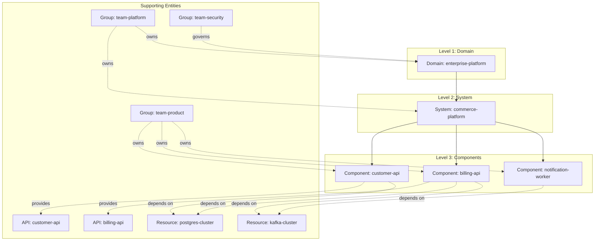
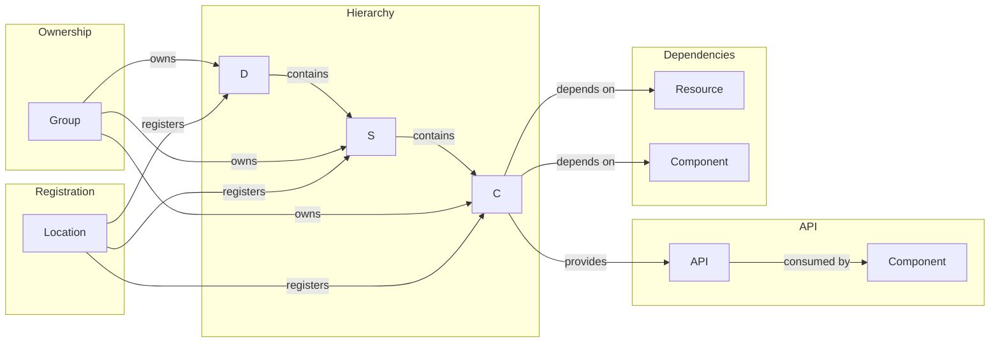
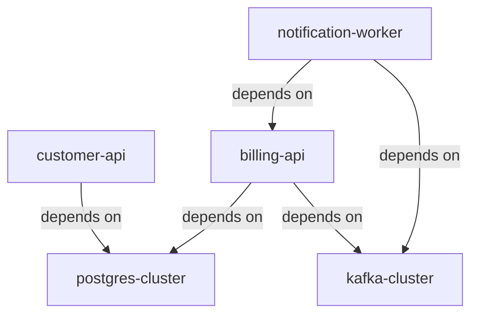

# Service Catalog Model

> **Architecture Document** — Describes the Backstage Software Catalog entity hierarchy, relationships, and schema in the Golden Path Platform.
>
> Related ADR: [ADR-0002: Catalog as the Platform Control Plane](../adr/0002-catalog-as-platform-control-plane.md)

---

## Purpose

The Service Catalog is the **single source of truth (SSOT)** for all service
metadata across the platform. This document defines the entity model, hierarchy,
relationships, and validation rules that keep the catalog accurate and useful.

---

## Entity Hierarchy

The catalog follows a strict **Domain → System → Component** hierarchy
derived from [Backstage's entity model](https://backstage.io/docs/features/software-catalog/descriptor-format/):



---

## Entity Types

### Domain (Level 1)

**Purpose**: Top-level business area that groups related systems.

**File**: `catalog/domain-enterprise-platform.yaml`

```yaml
apiVersion: backstage.io/v1alpha1
kind: Domain
metadata:
  name: enterprise-platform
  description: Enterprise platform domain covering all shared infrastructure
  annotations:
    github.com/org: golden-path
  labels:
    area: enterprise
    tier: domain
  tags:
    - enterprise
    - platform
spec:
  lifecycle: production
  owner: team-platform
```

**Rules**:
- Each Domain must have exactly one owner (a Group entity)
- Domain names are globally unique
- Domains are the top level; no entity can belong to more than one Domain

### System (Level 2)

**Purpose**: Logical grouping of components that collectively deliver a business capability.

**File**: `catalog/system-commerce-platform.yaml`

```yaml
apiVersion: backstage.io/v1alpha1
kind: System
metadata:
  name: commerce-platform
  description: Commerce platform system encompassing all customer, billing, and notification services
  annotations:
    github.com/org: golden-path
  labels:
    area: commerce
    tier: system
spec:
  lifecycle: production
  owner: team-platform
  providesApis:
    - customer-api
    - billing-api
```

**Rules**:
- Each System belongs to exactly one Domain (via naming convention or annotation)
- Systems can expose APIs (listed in `spec.providesApis`)
- Systems are the parent scope for Components

### Component (Level 3)

**Purpose**: Individual deployable service, library, or application.

**Example**: `catalog/service-customer-api.yaml`

```yaml
apiVersion: backstage.io/v1alpha1
kind: Component
metadata:
  name: customer-api
  description: Customer management API providing CRUD operations
  annotations:
    github.com/repo: golden-path/customer-api
    backstage.io/techdocs-ref: dir:.
  tags:
    - api, rest, customer, typescript
spec:
  type: service
  lifecycle: production
  owner: team-product
  system: commerce-platform
  providesApis:
    - customer-api
  dependsOn:
    - resource:postgres-cluster
  technology: node
```

**Rules**:
- Each Component must belong to exactly one System (`spec.system`)
- Each Component must have an owner (`spec.owner`)
- Components can provide APIs and declare dependencies

### API

**Purpose**: Exposed interface contract (OpenAPI, gRPC, etc.).

**Files**: `catalog/api-customer-openapi.yaml`, `catalog/api-billing-openapi.yaml`

**Rules**:
- APIs are provided by Components
- APIs can declare their own owner
- API specifications are linked via annotations

### Resource

**Purpose**: Infrastructure dependency (database, queue, bucket, etc.).

**Files**: `catalog/resource-postgres-cluster.yaml`, `catalog/resource-kafka-cluster.yaml`

**Example**:

```yaml
apiVersion: backstage.io/v1alpha1
kind: Resource
metadata:
  name: postgres-cluster
  description: PostgreSQL database cluster for persistent data storage
  annotations:
    github.com/repo: golden-path/infrastructure
    prometheus.io/job: postgres-exporter
  labels:
    area: infrastructure
    tier: data
spec:
  type: database
  lifecycle: production
  owner: team-platform
  connectionInfo:
    - target: postgres://commerce-db.cluster.svc:5432/commerce
```

**Rules**:
- Resources are owned by the Platform team
- Resources can be depended on by Components
- Connection information is stored in `spec.connectionInfo`

### Group

**Purpose**: Team or organizational unit for ownership assignment.

**Files**: `catalog/team-platform.yaml`, `catalog/team-product.yaml`, `catalog/team-security.yaml`

**Rules**:
- Groups are referenced by `spec.owner` on other entities
- Group names are globally unique
- Groups can have nested membership (not shown in this repo)

---

## Entity Relationships



### Relationship Types

| Relationship | Direction | Field | Description |
|-------------|-----------|-------|-------------|
| **Contains** | Domain → System | Convention | System belongs to Domain |
| **Contains** | System → Component | `spec.system` | Component belongs to System |
| **Owned by** | Entity → Group | `spec.owner` | Group owns entity |
| **Provides** | Component → API | `spec.providesApis` | Component exposes API |
| **Depends on** | Component → Resource | `spec.dependsOn` | Component uses resource |
| **Depends on** | Component → Component | `spec.dependsOn` | Component depends on another |
| **Registers** | Location → Entity | `spec.targets` | Location discovers entity |

---

## Catalog Registration Model

### The Location Entity

The `catalog/info.yaml` file is a **Location** entity that tells Backstage
where to find all other entities:

```yaml
apiVersion: backstage.io/v1alpha1
kind: Location
metadata:
  name: golden-path-catalog
  description: Root catalog location containing all entity definitions
spec:
  type: file
  targets:
    # Teams
    - ./team-platform.yaml
    - ./team-product.yaml
    - ./team-security.yaml
    # Services
    - ./service-customer-api.yaml
    - ./service-billing-api.yaml
    - ./service-notification-worker.yaml
    # System
    - ./system-commerce-platform.yaml
    # Domain
    - ./domain-enterprise-platform.yaml
    # APIs
    - ./api-customer-openapi.yaml
    - ./api-billing-openapi.yaml
    # Resources
    - ./resource-postgres-cluster.yaml
    - ./resource-kafka-cluster.yaml
```

### Registration Methods

| Method | How | When to Use |
|--------|-----|-------------|
| **Location entity** | Add target to `catalog/info.yaml` | Platform-managed entities |
| **Self-registration** | Include `catalog-info.yaml` in service repo | Service-owned entities |
| **GitHub discovery** | Backstage GitHub integration auto-discovers | Scale (100+ repos) |
| **Entity provider** | Programmatic catalog ingestion | Dynamic environments |

---

## Schema Validation

The catalog validator (`scripts/validate-catalog.py`) enforces these required fields:

| Field | Path | Description |
|-------|------|-------------|
| API Version | `apiVersion` | Must be `backstage.io/v1alpha1` |
| Kind | `kind` | Must be a valid Backstage entity kind |
| Name | `metadata.name` | Globally unique, lowercase kebab-case |
| Owner | `metadata.annotations.backstage.io/owner` | Must reference a valid Group |

### Validation Commands

```bash
# Validate all catalog entities
make catalog-validate

# Direct script execution
python3 scripts/validate-catalog.py
```

### Validation Output

```
Validating 12 catalog-info.yaml file(s)...

✅ catalog/domain-enterprise-platform.yaml
✅ catalog/system-commerce-platform.yaml
✅ catalog/service-customer-api.yaml
✅ catalog/service-billing-api.yaml
✅ catalog/service-notification-worker.yaml
✅ catalog/api-customer-openapi.yaml
✅ catalog/api-billing-openapi.yaml
✅ catalog/resource-postgres-cluster.yaml
✅ catalog/resource-kafka-cluster.yaml
✅ catalog/team-platform.yaml
✅ catalog/team-product.yaml
✅ catalog/team-security.yaml

Results: 12 valid, 0 invalid out of 12 file(s)
All catalog files are valid.
```

---

## Entity Inventory

### Current Catalog Entities (12)

| Kind | Name | Owner | Lifecycle | System |
|------|------|-------|-----------|--------|
| Domain | enterprise-platform | team-platform | production | — |
| System | commerce-platform | team-platform | production | — |
| Component | customer-api | team-product | production | commerce-platform |
| Component | billing-api | team-product | production | commerce-platform |
| Component | notification-worker | team-product | experimental | commerce-platform |
| API | customer-api | team-product | production | commerce-platform |
| API | billing-api | team-product | production | commerce-platform |
| Resource | postgres-cluster | team-platform | production | — |
| Resource | kafka-cluster | team-platform | production | — |
| Group | team-platform | team-platform | production | — |
| Group | team-product | team-platform | production | — |
| Group | team-security | team-platform | production | — |

### Example Service Entities (2)

| Kind | Name | Owner | Lifecycle | System |
|------|------|-------|-----------|--------|
| Component | customer-api (example) | team-product | production | commerce-platform |
| Component | billing-worker (example) | team-product | experimental | commerce-platform |

---

## Annotation Schema

### Standard Annotations

| Annotation | Purpose | Example |
|-----------|---------|---------|
| `github.com/project-slug` | Link to GitHub repository | `golden-path/customer-api` |
| `backstage.io/techdocs-ref` | TechDocs documentation source | `dir:.` |
| `backstage.io/owner` | Entity owner (alternative to spec.owner) | `team-product` |
| `backstage.io/runbook-url` | Link to operational runbook | `https://...` |
| `backstage.io/health-endpoint` | Health check endpoint path | `/healthz` |
| `backstage.io/slo` | Service level objective definition | `99.9% uptime` |
| `backstage.io/data-classification` | Data sensitivity level | `confidential` |
| `backstage.io/deployment-manifest` | Path to deployment manifest | `infra/k8s/deployment.yaml` |
| `prometheus.io/job` | Prometheus scrape job name | `postgres-exporter` |

### Label Schema

| Label | Values | Purpose |
|-------|--------|---------|
| `area` | `enterprise`, `commerce`, `product`, `platform`, `security`, `infrastructure` | Business area |
| `tier` | `domain`, `system`, `api`, `worker`, `data`, `messaging`, `infrastructure` | Technical tier |
| `language` | `typescript`, `java`, `python`, `go` | Programming language |

---

## Dependency Graph

The catalog's `spec.dependsOn` field creates a queryable dependency graph:



This graph enables:
- **Impact analysis**: "If postgres-cluster goes down, what services are affected?"
- **Dependency visualization**: "What does billing-api depend on?"
- **Risk assessment**: "Which services have the most dependencies?"

---

## Catalog Hygiene

### Common Issues

| Issue | Impact | Mitigation |
|-------|--------|------------|
| Missing `catalog-info.yaml` | Service invisible in catalog | Scaffolder auto-generates |
| Stale owner | Wrong team notified during incidents | Quarterly ownership review |
| Missing dependencies | Incomplete dependency graph | CI validation of dependsOn |
| No TechDocs | No documentation in catalog | Scorecard check for docs |
| Missing system | Orphaned component in catalog | OPA policy `require_system.rego` |

### Hygiene Commands

```bash
# Validate all entities
make catalog-validate

# Check scorecard (finds metadata gaps)
make scorecard

# Test OPA policies (enforces catalog standards)
make policy-test
```

---

## Decision References

| Decision | ADR | Impact on Catalog |
|----------|-----|-------------------|
| Catalog as control plane | [ADR-0002](../adr/0002-catalog-as-platform-control-plane.md) | Defines SSOT model and entity schema |
| Policy-gated golden paths | [ADR-0003](../adr/0003-policy-gated-golden-paths.md) | OPA validates catalog entities |

---

## Related Documents

- [System Context](context.md) — Platform boundaries
- [Platform Operating Model](platform-operating-model.md) — Team ownership patterns
- [Software Template Model](software-template-model.md) — How templates produce catalog entities
- [Production Readiness](production-readiness.md) — Scorecard evaluates catalog completeness
- [Policy Gates](policy-gates.md) — OPA policies enforce catalog standards
