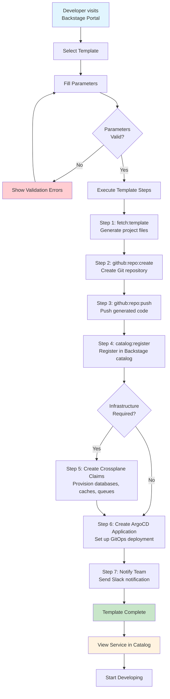
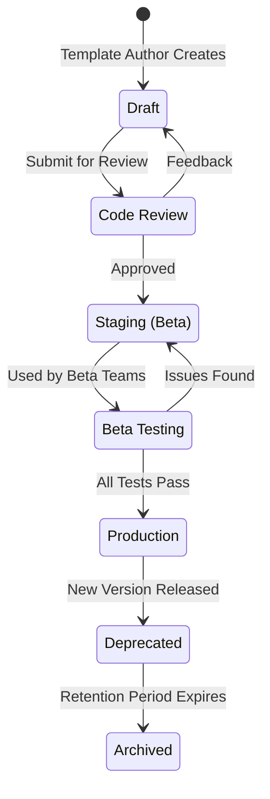

# Software Template Model

## Overview

Software templates are the engine of the Golden Path Platform. They codify organizational best practices into reusable, self-service workflows that generate new projects, services, libraries, and infrastructure. When a developer uses a template, they get a fully configured, policy-compliant, production-ready starting point — not a blank repository.

Templates exist because the "right way" to create a new service should be obvious, easy, and consistent. Without templates, each team creates services differently, leading to inconsistency, compliance gaps, and a fragmented developer experience.

## Why Templates Matter

### The Consistency Problem

Without templates:

- CI/CD pipelines vary wildly between teams
- Project structure is inconsistent, making navigation difficult
- Security scanning is sometimes forgotten
- Monitoring and alerting are set up ad-hoc
- Catalog entries are incomplete or missing

With templates:

- Every new service starts with the same structure
- CI/CD pipelines include all required stages
- Security scanning is built-in and mandatory
- Monitoring is pre-configured with standard dashboards
- Catalog entries are auto-generated and complete

### The Speed Problem

Creating a new service from scratch takes days to weeks. With templates:

- A developer fills in a form
- The template generates the project structure
- CI/CD, monitoring, and security are pre-configured
- The service is registered in the catalog
- Infrastructure is provisioned via Crossplane claims
- The service is deployable in under 10 minutes

### The Knowledge Problem

Templates encode institutional knowledge:

- "We use this folder structure because..."
- "These CI stages are required because..."
- "This monitoring setup catches the issues we've seen before..."
- "These security scans are mandatory because of compliance requirements"

When a senior engineer creates a template, they capture years of operational experience in a repeatable artifact.

## Template Anatomy

A Backstage scaffolder template consists of several key parts:

```yaml
# Template Entity
apiVersion: scaffolder.backstage.io/v1beta3
kind: Template
metadata:
  name: node-service
  title: Node.js Microservice
  description: Creates a new Node.js/TypeScript microservice with CI/CD, monitoring, and security scanning
  tags:
    - node
    - typescript
    - microservice
    - recommended
  annotations:
    backstage.io/source-ref: https://github.com/org/backstage-templates/blob/main/templates/node-service/template.yaml
  links:
    - url: https://wiki.internal/node-service-template
      title: Template Documentation
      icon: docs
  owner: team-platform
  lifecycle: production
```

### Parameter Schema

Parameters define what the template asks the developer. The schema uses JSON Schema for validation:

```yaml
spec:
  parameters:
    - title: Service Information
      description: Basic information about the new service
      required:
        - componentName
        - owner
        - description
      properties:
        componentName:
          title: Service Name
          type: string
          description: Unique name for the service (lowercase, hyphens only)
          pattern: ^[a-z][a-z0-9-]*[a-z0-9]$
          minLength: 3
          maxLength: 63
          ui:
            helpText: "Use lowercase letters, numbers, and hyphens. Example: payment-api"
        
        owner:
          title: Owner
          type: string
          description: Team that owns this service
          ui:
            field: OwnerPicker
            options:
              - allowAnnotations: ['github.com/team-slug']
        
        description:
          title: Description
          type: string
          description: Brief description of the service's purpose
          minLength: 10
          maxLength: 200
        
        tier:
          title: Service Tier
          type: string
          description: SLA tier for this service
          enum:
            - 1-mission-critical
            - 2-business-critical
            - 3-business-important
            - 4-standard
            - 5-best-effort
          default: 4-standard
        
        domain:
          title: Domain
          type: string
          description: Business domain this service belongs to
          enum:
            - payments
            - identity
            - commerce
            - analytics
            - platform
            - data
        
        system:
          title: System
          type: string
          description: System this service is part of (must exist in catalog)
          ui:
            field: EntityPicker
            options:
              - kind: System
                allowAnnotations: ['backstage.io/domain']
        
        database:
          title: Database Required
          type: boolean
          description: Does this service need a database?
          default: false
        
        cache:
          title: Cache Required
          type: boolean
          description: Does this service need a Redis cache?
          default: false
        
        queue:
          title: Message Queue
          type: boolean
          description: Does this service need a message queue (Kafka)?
          default: false
        
        region:
          title: Deployment Region
          type: string
          description: Primary deployment region
          enum:
            - us-east-1
            - us-west-2
            - eu-west-1
          default: us-east-1
    
    - title: Infrastructure
      description: Infrastructure requirements
      properties:
        cpu:
          title: CPU Request
          type: string
          enum:
            - 100m
            - 250m
            - 500m
            - 1
            - 2
          default: 250m
        
        memory:
          title: Memory Request
          type: string
          enum:
            - 128Mi
            - 256Mi
            - 512Mi
            - 1Gi
            - 2Gi
          default: 512Mi
        
        replicas:
          title: Minimum Replicas
          type: integer
          minimum: 1
          maximum: 10
          default: 2
```

### Template Steps

Steps define what the template actually does. Each step is an action that executes sequentially:

```yaml
spec:
  steps:
    # Step 1: Fetch the template skeleton
    - id: fetch
      name: Fetch Template
      action: fetch:template
      input:
        url: ./skeleton
        values:
          componentName: ${{ parameters.componentName }}
          description: ${{ parameters.description }}
          owner: ${{ parameters.owner }}
          tier: ${{ parameters.tier }}
          domain: ${{ parameters.domain }}
          system: ${{ parameters.system }}
          database: ${{ parameters.database }}
          cache: ${{ parameters.cache }}
          queue: ${{ parameters.queue }}
          region: ${{ parameters.region }}
          year: ${{ new Date().getFullYear() }}
          email: ${{ user.metadata.name }}
    
    # Step 2: Generate additional files
    - id: generate-cicd
      name: Generate CI/CD Pipeline
      action: fetch:template
      input:
        url: ./cicd-skeleton
        values:
          componentName: ${{ parameters.componentName }}
          tier: ${{ parameters.tier }}
          region: ${{ parameters.region }}
    
    # Step 3: Register in catalog
    - id: register-catalog
      name: Register in Catalog
      action: catalog:register
      input:
        repoContentsUrl: ${{ steps.fetch.output.repoContentsUrl }}
        catalogInfoPath: /catalog-info.yaml
    
    # Step 4: Create GitHub repository
    - id: create-repo
      name: Create GitHub Repository
      action: github:repo:create
      input:
        repoName: ${{ parameters.componentName }}
        description: ${{ parameters.description }}
        owner: ${{ parameters.owner | replace('team-', '') }}
        private: true
        visibility: internal
    
    # Step 5: Push code to repository
    - id: push-to-github
      name: Push to GitHub
      action: github:repo:push
      input:
        repoUrl: ${{ steps.create-repo.output.remoteUrl }}
    
    # Step 6: Create infrastructure claims
    - id: create-infrastructure
      name: Provision Infrastructure
      if: ${{ parameters.database || parameters.cache || parameters.queue }}
      action: exec
      input:
        command: bash
        args:
          - -c
          - |
            # Create Crossplane claims based on parameters
            if [ "${{ parameters.database }}" = "true" ]; then
              kubectl apply -f k8s/claims/postgres.yaml
            fi
            if [ "${{ parameters.cache }}" = "true" ]; then
              kubectl apply -f k8s/claims/redis.yaml
            fi
            if [ "${{ parameters.queue }}" = "true" ]; then
              kubectl apply -f k8s/claims/kafka.yaml
            fi
    
    # Step 7: Configure ArgoCD application
    - id: create-argocd
      name: Create ArgoCD Application
      action: kubernetes:create
      input:
        apiVersion: argoproj.io/v1alpha1
        kind: Application
        metadata:
          name: ${{ parameters.componentName }}
          namespace: argocd
          annotations:
            argocd.argoproj.io/sync-wave: "1"
        spec:
          project: default
          source:
            repoURL: ${{ steps.create-repo.output.remoteUrl }}
            targetRevision: main
            path: k8s/overlays/${{ parameters.region }}
          destination:
            server: https://kubernetes.default.svc
            namespace: ${{ parameters.componentName }}
          syncPolicy:
            automated:
              prune: true
              selfHeal: true
            syncOptions:
              - CreateNamespace=true
    
    # Step 8: Notify team
    - id: notify
      name: Notify Team
      action: slack:send-message
      input:
        channel: '#engineering'
        message: |
          🚀 New service created: ${{ parameters.componentName }}
          Owner: ${{ parameters.owner }}
          Domain: ${{ parameters.domain }}
          Tier: ${{ parameters.tier }}
          
          Repository: ${{ steps.create-repo.output.remoteUrl }}
          Catalog: ${{ secrets.CATALOG_URL }}/${{ parameters.componentName }}
```

## Step Types

### fetch:template

Templates a directory of files using Nunjucks templating. This is the most common step — it takes a skeleton directory and generates output files with variable substitution.

**Use cases:**
- Generating project structure
- Creating configuration files
- Writing Dockerfiles and Kubernetes manifests
- Generating CI/CD pipeline definitions

**Skeleton structure:**
```
skeleton/
├── catalog-info.yaml
├── Dockerfile
├── README.md
├── package.json
├── tsconfig.json
├── src/
│   ├── index.ts
│   ├── app.ts
│   └── routes/
├── k8s/
│   ├── base/
│   │   ├── deployment.yaml
│   │   ├── service.yaml
│   │   └── hpa.yaml
│   └── overlays/
│       ├── production/
│       │   └── kustomization.yaml
│       └── staging/
│           └── kustomization.yaml
├── .github/
│   └── workflows/
│       ├── ci.yaml
│       ├── cd.yaml
│       └── security.yaml
└── docs/
    └── index.md
```

### fetch:plain

Downloads a directory without templating. Useful for including pre-built artifacts that don't need variable substitution.

**Use cases:**
- Including static configuration files
- Downloading pre-built binaries
- Including example code or documentation

### catalog:register

Registers a new entity in the Backstage catalog. This is essential for making the newly created service discoverable.

**Use cases:**
- Registering the new component
- Registering APIs
- Registering resources

### github:repo:create / github:repo:push

Creates a new GitHub repository and pushes the generated code. These steps handle the Git operations.

**Use cases:**
- Creating the repository
- Setting up branch protection
- Pushing the initial code

### kubernetes:create / kubernetes:apply

Creates or applies Kubernetes resources. Used for creating namespaces, ArgoCD applications, Crossplane claims, etc.

**Use cases:**
- Creating ArgoCD applications
- Applying Crossplane claims
- Setting up namespaces with RBAC

### exec

Executes arbitrary shell commands. The escape hatch for anything the built-in steps can't handle.

**Use cases:**
- Running custom scripts
- Executing kubectl commands
- Running database migrations

### slack:send-message / email:send

Sends notifications to Slack or email. Keeps teams informed about new services and infrastructure changes.

**Use cases:**
- Notifying teams about new services
- Sending onboarding information
- Alerting about infrastructure provisioning

## Template Flow



## Template Promotion

### Development → Staging → Production

Templates go through a promotion process before becoming official:



### Template Versions

Templates are versioned using Git tags:

```yaml
metadata:
  name: node-service
  annotations:
    backstage.io/source-ref: https://github.com/org/templates/blob/v2.3.0/templates/node-service/template.yaml
```

Version management:

- **Major version** — Breaking changes (new parameter schema, different output structure)
- **Minor version** — New features, additional steps
- **Patch version** — Bug fixes, documentation updates

### Template Testing

Templates are tested before promotion:

1. **Parameter validation** — Ensure all parameter combinations work
2. **Step execution** — Run all steps in a test environment
3. **Output validation** — Verify generated files are correct
4. **Integration testing** — Ensure the generated service deploys and runs
5. **Security scanning** — Scan generated code for vulnerabilities
6. **Compliance checking** — Verify all required files are present

## Custom Actions

### Building Custom Actions

When built-in steps aren't enough, the platform team creates custom actions:

```typescript
// plugins/scaffolder-backend-module-custom/src/actions/create-crossplane-claim.ts
import { createTemplateAction } from '@backstage/plugin-scaffolder-node';
import { KubernetesClient } from '@kubernetes/client-node';

export const createCrossplaneClaim = createTemplateAction<{
  composition: string;
  claimName: string;
  namespace: string;
  parameters: Record<string, any>;
}>({
  id: 'custom:create-crossplane-claim',
  description: 'Creates a Crossplane claim for infrastructure provisioning',
  schema: {
    input: {
      required: ['composition', 'claimName', 'namespace', 'parameters'],
      type: 'object',
      properties: {
        composition: {
          type: 'string',
          title: 'Composition',
          description: 'The Crossplane composition to use',
        },
        claimName: {
          type: 'string',
          title: 'Claim Name',
          description: 'Name of the Crossplane claim',
        },
        namespace: {
          type: 'string',
          title: 'Namespace',
          description: 'Kubernetes namespace for the claim',
        },
        parameters: {
          type: 'object',
          title: 'Parameters',
          description: 'Parameters for the composition',
        },
      },
    },
  },
  async handler(ctx) {
    const k8s = new KubernetesClient();
    const claim = {
      apiVersion: 'database.example.org/v1alpha1',
      kind: 'PostgreSQL',
      metadata: {
        name: ctx.input.claimName,
        namespace: ctx.input.namespace,
      },
      spec: {
        compositionSelector: {
          matchLabels: {
            composition: ctx.input.composition,
          },
        },
        parameters: ctx.input.parameters,
      },
    };

    await k8s.createNamespacedCustomObject(
      'database.example.org',
      'v1alpha1',
      ctx.input.namespace,
      'postgresqls',
      claim
    );

    ctx.logger.info(`Created Crossplane claim: ${ctx.input.claimName}`);
  },
});
```

### Registering Custom Actions

Custom actions are registered in the scaffolder configuration:

```yaml
# app-config.yaml
scaffolder:
  additionalActions:
    - ./plugins/scaffolder-backend-module-custom/src/actions/create-crossplane-claim.ts
    - ./plugins/scaffolder-backend-module-custom/src/actions/slack-notify.ts
```

## Template Organization

### Template Directory Structure

Templates are organized in a central repository:

```
backstage-templates/
├── templates/
│   ├── node-service/
│   │   ├── template.yaml
│   │   ├── skeleton/
│   │   │   └── ... (template files)
│   │   ├── cicd-skeleton/
│   │   │   └── ... (CI/CD template files)
│   │   └── docs/
│   │       └── README.md
│   ├── java-service/
│   │   ├── template.yaml
│   │   └── skeleton/
│   ├── python-service/
│   │   ├── template.yaml
│   │   └── skeleton/
│   ├── react-app/
│   │   ├── template.yaml
│   │   └── skeleton/
│   ├── ts-library/
│   │   ├── template.yaml
│   │   └── skeleton/
│   └── database/
│       ├── template.yaml
│       └── skeleton/
├── docs/
│   ├── contributing.md
│   └── testing.md
└── README.md
```

### Template Categorization

Templates are categorized for easy discovery:

| Category | Templates | Audience |
|----------|-----------|----------|
| **Services** | node-service, java-service, python-service, go-service | Backend developers |
| **Libraries** | ts-library, java-library | All developers |
| **Frontends** | react-app, nextjs-app | Frontend developers |
| **Infrastructure** | database, cache, queue | DevOps / Platform |
| **Documentation** | techdocs | All developers |
| **APIs** | grpc-service, graphql-service | Backend developers |

## Template Governance

### Template Ownership

Each template has a clear owner (usually the platform team):

```yaml
metadata:
  owner: team-platform
  annotations:
    github.com/project-slug: org/backstage-templates
    backstage.io/techdocs-ref: dir:.
```

### Template Review Process

1. **Author** creates or updates a template
2. **Platform team** reviews for best practices and standards
3. **Security team** reviews for security implications
4. **Beta testing** with a small group of developers
5. **Production promotion** based on feedback and testing

### Template Lifecycle

| Stage | Duration | Requirements |
|-------|----------|--------------|
| **Draft** | As needed | Template author working on it |
| **Review** | 1-2 days | Code review, security review |
| **Beta** | 1-2 weeks | Used by 2-3 teams, feedback collected |
| **Production** | Ongoing | All tests pass, documentation complete |
| **Deprecated** | 3-6 months | New version available, migration guide |

## Advanced Template Patterns

### Conditional Steps

Steps can be conditionally executed based on parameters:

```yaml
steps:
  - id: create-database
    name: Create Database
    if: ${{ parameters.database }}
    action: custom:create-crossplane-claim
    input:
      composition: xpostgresql.database.example.org/v1
      claimName: ${{ parameters.componentName }}-db
      namespace: ${{ parameters.componentName }}
      parameters:
        size: small
        region: ${{ parameters.region }}
```

### Multi-Step Infrastructure

Templates can provision complex infrastructure:

```yaml
steps:
  - id: create-namespaces
    name: Create Namespaces
    action: kubernetes:create
    input:
      # Create dev, staging, production namespaces
  
  - id: create-rbac
    name: Create RBAC
    action: kubernetes:create
    input:
      # Create role bindings for the team
  
  - id: create-database
    name: Create Database
    action: custom:create-crossplane-claim
    input:
      # Provision PostgreSQL
  
  - id: create-cache
    name: Create Cache
    if: ${{ parameters.cache }}
    action: custom:create-crossplane-claim
    input:
      # Provision Redis
  
  - id: configure-secrets
    name: Configure Secrets
    action: custom:configure-secrets
    input:
      # Set up Vault paths for the service
```

### Template Composition

Templates can be composed — one template can invoke another:

```yaml
steps:
  - id: create-service
    name: Create Base Service
    action: fetch:template
    input:
      url: ./node-service-skeleton
  
  - id: create-database
    name: Provision Database
    action: fetch:template
    input:
      url: ./database-skeleton
      values:
        serviceName: ${{ parameters.componentName }}
        namespace: ${{ parameters.componentName }}
```

## Template Metrics

The platform tracks template usage to understand adoption and identify issues:

| Metric | Description | Target |
|--------|-------------|--------|
| **Usage count** | Times each template has been used | Increasing trend |
| **Success rate** | Percentage of template runs that succeed | >95% |
| **Avg. completion time** | Average time to complete template | <10 minutes |
| **Parameter distribution** | Which parameter values are most common | For optimization |
| **Error rate** | Percentage of template runs that fail | <5% |
| **Customization rate** | Percentage of users who modify defaults | For template improvement |

## Related Documentation

- [Context](./context.md) — System context and external integrations
- [Platform Operating Model](./platform-operating-model.md) — Team structure and processes
- [Service Catalog Model](./service-catalog-model.md) — How catalog entries are structured
- [Production Readiness](./production-readiness.md) — Scorecard system for generated services
- [Policy Gates](./policy-gates.md) — How templates enforce policies
- [Crossplane Abstractions](./crossplane-abstractions.md) — Infrastructure provisioning
