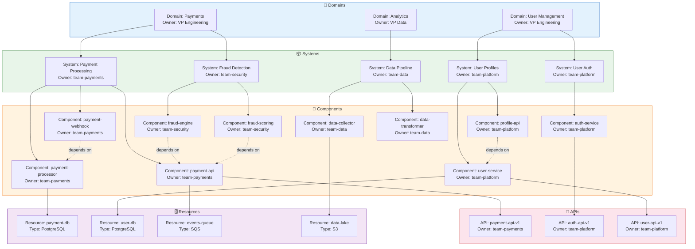

# Catalog Ownership Model

Domain > System > Component hierarchy with ownership relationships.



## Ownership Model Description

### Hierarchy

```
Domain (Business Area)
  └── System (Logical Grouping)
       └── Component (Deployable Service)
            ├── API (Exposed Interface)
            ├── Resource (Infrastructure Dependency)
            └── Library (Shared Code)
```

### Entity Types

| Entity | Purpose | Example |
|--------|---------|---------|
| **Domain** | Top-level business area | Payments, User Management, Analytics |
| **System** | Logical grouping within a domain | Payment Processing, User Auth |
| **Component** | Individual deployable service | payment-api, auth-service |
| **API** | Exposed interface contract | payment-api-v1 |
| **Resource** | Infrastructure dependency | PostgreSQL database, S3 bucket |
| **Library** | Shared code package | @goldenpath/utils |

### Ownership Rules

1. **Every entity must have an owner** — No orphaned components
2. **Owner must be a Group entity** — Teams, not individuals
3. **Ownership is explicit** — Defined in `catalog-info.yaml`
4. **Ownership is verifiable** — Scorecard checks owner is valid

### Ownership YAML

```yaml
apiVersion: backstage.io/v1alpha1
kind: Component
metadata:
  name: payment-api
spec:
  owner: team-payments           # Must be a registered Group
  system: payment-system         # Must be a registered System
  providesApis:
    - payment-api-v1             # Must be registered API entities
  dependsOn:
    - component:payment-processor
    - resource:payment-db
```

### Dependency Graph

```
payment-api ──depends on──▶ payment-processor ──depends on──▶ payment-db
      │
      └──provides──▶ payment-api-v1

fraud-engine ──depends on──▶ payment-api
fraud-scoring ──depends on──▶ payment-api

payment-webhook ──depends on──▶ payment-processor
```

### Impact Analysis

When a component changes, the dependency graph enables:
- **Blast radius calculation** — How many services are affected?
- **Owner notification** — Who needs to be alerted?
- **Change assessment** — What APIs are impacted?
- **Rollback planning** — What needs to be reverted?
