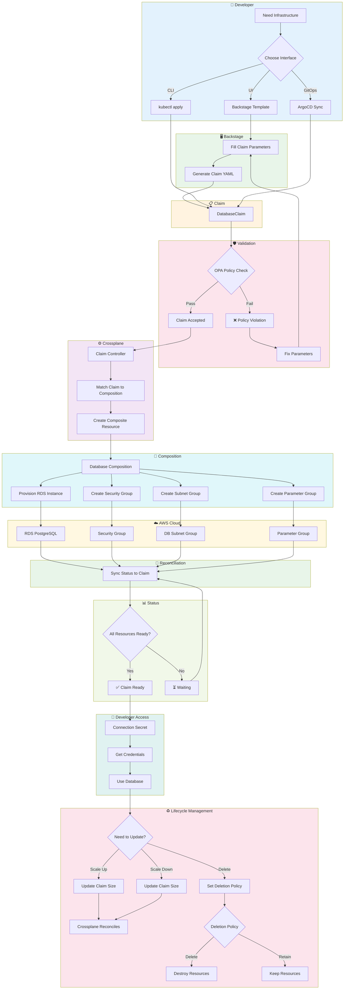

# Crossplane Claim Flow

Claim → Composition → Provisioning flow for infrastructure self-service.



## Claim Types

### DatabaseClaim

```yaml
apiVersion: goldenpath.platform/v1alpha1
kind: DatabaseClaim
metadata:
  name: payments-db
  namespace: team-payments
spec:
  size: medium          # small | medium | large | xlarge
  engine: postgres      # postgres | mysql
  highAvailability: true
  backupRetention: 30d
  deletionPolicy: retain
```

**Provisions**:
- RDS instance (encrypted, logged, tagged)
- Security group (inbound from application namespace)
- Subnet group (in private subnets)
- Parameter group (tuned for workload)
- CloudWatch alarms (CPU, memory, connections)

### QueueClaim

```yaml
apiVersion: goldenpath.platform/v1alpha1
kind: QueueClaim
metadata:
  name: payment-events
  namespace: team-payments
spec:
  size: medium          # small | medium | large
  visibilityTimeout: 30s
  retentionPeriod: 4d
  deadLetterQueue: true
  encryption: enabled
```

**Provisions**:
- SQS queue (encrypted, tagged)
- Dead letter queue (if enabled)
- IAM policy (producer/consumer roles)
- CloudWatch alarms (queue depth, age)

### BucketClaim

```yaml
apiVersion: goldenpath.platform/v1alpha1
kind: BucketClaim
metadata:
  name: payment-receipts
  namespace: team-payments
spec:
  sizeClass: standard    # standard | glacier
  versioning: enabled
  encryption: sse-kms
  lifecycle:
    - transition: glacier
      days: 90
    - expiration: 365d
```

**Provisions**:
- S3 bucket (encrypted, versioned, tagged)
- Lifecycle rules (as specified)
- Bucket policy (least-privilege access)
- CloudWatch metrics

## Composition Pattern

### How Compositions Work

```
Claim (Developer Interface)
    │
    ├─► Composition (Implementation)
    │       │
    │       ├─► XRD (Schema Definition)
    │       │       └─► Defines claim parameters
    │       │
    │       ├─► Resources (AWS Components)
    │       │       ├─► RDS Instance
    │       │       ├─► Security Group
    │       │       ├─► Subnet Group
    │       │       └─► Parameter Group
    │       │
    │       └─► Patches (Parameter Mapping)
    │               └─► Maps claim params to resource configs
    │
    └─► Connection Secret
            └─► Developer gets credentials
```

### Size Mapping

| Claim Size | RDS Instance | CPU | Memory | Storage |
|-----------|--------------|-----|--------|---------|
| `small` | db.t3.micro | 2 vCPU | 1 GB | 20 GB |
| `medium` | db.t3.medium | 2 vCPU | 4 GB | 100 GB |
| `large` | db.r5.large | 2 vCPU | 16 GB | 500 GB |
| `xlarge` | db.r5.xlarge | 4 vCPU | 32 GB | 1 TB |

## Reconciliation

Crossplane continuously reconciles desired state:

```
Desired State (Claim) ←─────┐
                             │
                    ┌────────▼────────┐
                    │   Reconciler    │
                    └────────┬────────┘
                             │
                    ┌────────▼────────┐
                    │  Compare State  │
                    └────────┬────────┘
                             │
                    ┌────────▼────────┐
                    │  Drift? Yes/No  │
                    └────────┬────────┘
                             │
              ┌──────────────┼──────────────┐
              │              │              │
         ┌────▼────┐   ┌────▼────┐   ┌────▼────┐
         │  No     │   │ Yes:    │   │ Yes:    │
         │ Drift   │   │ Create  │   │ Update  │
         └─────────┘   └─────────┘   └─────────┘
```

## Deletion Policies

| Policy | Behavior | Use Case |
|--------|----------|----------|
| `Delete` | Destroy all AWS resources | Development environments |
| `Retain` | Keep resources, remove claim | Production databases |
| `Orphan` | Keep resources, detach from claim | Hand-off to another team |

## Self-Service Benefits

1. **Minutes, not days** — Developers provision infrastructure in < 5 minutes
2. **Consistent patterns** — All databases follow approved architecture
3. **Policy-gated** — OPA validates claims against organizational standards
4. **GitOps-compatible** — Claims stored in Git, reconciled automatically
5. **Cost visibility** — All resources tagged with team and cost center
