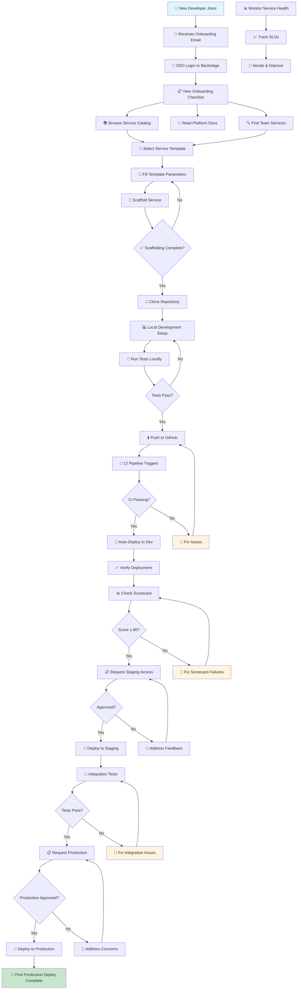

# Developer Onboarding Flow

Developer journey from signup to first production deploy.

## Flow Description

### Phase 1: Discovery (Days 1-2)
1. **Join the organization** — Receive onboarding email with Backstage URL
2. **SSO Login** — Authenticate via corporate SSO
3. **Explore the catalog** — Browse existing services, read documentation
4. **Find team services** — Locate services owned by your team

### Phase 2: Service Creation (Days 2-3)
5. **Select template** — Choose appropriate service template from Backstage
6. **Fill parameters** — Provide service name, description, owner, system
7. **Scaffold** — Template creates repository, CI/CD, and catalog entry
8. **Clone and develop** — Set up local environment, write code

### Phase 3: Validation (Days 3-5)
9. **CI pipeline** — Automated build, lint, test on every push
10. **Auto-deploy to dev** — Successful CI triggers dev deployment
11. **Scorecard validation** — Verify production readiness score ≥ 80
12. **Fix failures** — Address any failing checks

### Phase 4: Promotion (Days 5-10)
13. **Staging access** — Request and receive staging deployment
14. **Integration testing** — Verify service works in staging
15. **Production request** — Submit for production deployment
16. **Production deploy** — Deploy to production after approval

### Phase 5: Operations (Ongoing)
17. **Monitor health** — Track service metrics and SLOs
18. **Iterate** — Improve based on feedback and scorecard results

## Key Metrics

| Metric | Target | Measurement |
|--------|--------|-------------|
| Time to first deploy | < 30 minutes | Template creation to dev deployment |
| Time to production | < 5 business days | First commit to production deploy |
| Developer satisfaction | > 4.0/5.0 | Quarterly survey |
| Scorecard pass rate | > 90% | Services with score ≥ 80 |
