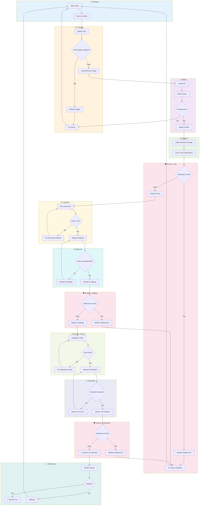

# Policy Gate Flow

How policies gate deployments across the platform.



## Policy Enforcement Points

### Layer 1: OPA (Open Policy Agent)

**When**: During CI pipeline (shift-left)
**What**: Validates catalog entities, application configs, and deployment manifests

| Policy | Scope | Action |
|--------|-------|--------|
| `catalog.required-fields` | catalog-info.yaml | Block merge if missing |
| `catalog.ownership-required` | catalog-info.yaml | Block merge if invalid |
| `catalog.docs-required` | catalog-info.yaml | Block merge if missing |
| `catalog.scorecard-minimum` | scorecard | Block promotion if < 80 |
| `app.image-policy` | Dockerfile | Block if unapproved base |
| `app.secret-management` | config files | Block if hardcoded secrets |

### Layer 2: Kyverno (Kubernetes Admission Control)

**When**: At Kubernetes API server (runtime)
**What**: Validates Kubernetes resources before they're created/updated

| Policy | Scope | Action |
|--------|-------|--------|
| `require-labels` | Deployments, Services | Block if missing labels |
| `require-resource-limits` | Pods | Block if no limits set |
| `disallow-privileged` | Pods | Block privileged containers |
| `require-network-policy` | Namespaces | Block if no default deny |
| `enforce-image-registries` | Pods | Block unapproved registries |
| `require-cost-center-label` | Namespaces | Block if no billing tag |

### Policy Modes

| Mode | Behavior | Use Case |
|------|----------|----------|
| `audit` | Log violations but allow | New policies, testing phase |
| `enforce` | Block on violation | Established policies |
| `dryrun` | Simulate enforcement | Policy development |

### Policy Violation Response

```
Violation Detected
    │
    ├─► CI Pipeline: Build fails, PR blocked
    │   └─► Developer sees error message with remediation steps
    │
    ├─► Kyverno: Admission denied
    │   └─► Deployment fails, error logged
    │   └─► Developer sees admission webhook error
    │
    └─► Scorecard: Score drops below threshold
        └─► Promotion blocked until score ≥ 80
        └─► Owner notified via dashboard
```

### Progressive Enforcement

1. **Phase 1 (Week 1-2)**: All new policies in `audit` mode
2. **Phase 2 (Week 3-4)**: Review violation data, tune policies
3. **Phase 3 (Week 5+)**: Switch to `enforce` mode
4. **Ongoing**: Monthly policy review, retire outdated policies
