# Production Readiness Lifecycle

Scorecard lifecycle from experimental to production.

```mermaid
stateDiagram-v2
    [*] --> Experimental
    
    state Experimental {
        [*] --> Scaffolded
        Scaffolded --> LocalDev: Developer works locally
        LocalDev --> CIDeployed: First CI deploy
        CIDeployed --> Scored: Scorecard runs
    }
    
    Experimental --> Development: Score ≥ 40
    
    state Development {
        [*] --> DevDeployed
        DevDeployed --> FeatureComplete: All features implemented
        FeatureComplete --> TestPassing: Tests pass
        TestPassing --> DocsWritten: Documentation complete
        DocsWritten --> DevScored: Scorecard runs
    }
    
    Development --> Staging: Score ≥ 60
    
    state Staging {
        [*] --> StagingDeployed
        StagingDeployed --> IntegrationTested: Integration tests pass
        IntegrationTested --> LoadTested: Load testing complete
        LoadTested --> SecurityScanned: Security scan passes
        SecurityScanned --> StagingScored: Scorecard runs
    }
    
    Staging --> Production: Score ≥ 80
    
    state Production {
        [*] --> ProdDeployed
        ProdDeployed --> Monitored: Monitoring active
        Monitored --> SLOsTracked: SLOs defined
        SLOsTracked --> Optimized: Performance optimized
        Optimized --> ProdScored: Scorecard runs
    }
    
    Production --> Deprecated: Deprecation Trigger
    
    state Deprecated {
        [*] --> NoticePosted
        NoticePosted --> MigrationStarted: Dependencies migrating
        MigrationStarted --> TrafficReduced: Traffic dropping
        TrafficReduced --> DeprecatedScored: Scorecard runs
    }
    
    Deprecated --> Retired: All Dependencies Removed
    
    state Retired {
        [*] --> Decommissioned
        Decommissioned --> Archived: Repository archived
        Archived --> Removed: Catalog entity marked retired
    }
    
    Retired --> [*]
```



## Lifecycle Stages

### Stage 1: Experimental (Score: 0-39)

**Definition**: New service, early development phase

**Requirements**:
- ✅ Repository created
- ✅ `catalog-info.yaml` exists
- ✅ Basic CI pipeline running

**Scorecard Checks**:
| Check | Status | Points |
|-------|--------|--------|
| Catalog Info Complete | ✅ Required | 10 |
| Documentation Present | ❌ Optional | 0 |
| CI Pipeline Passing | ✅ Required | 10 |
| Ownership Configured | ✅ Required | 10 |
| Monitoring Configured | ❌ Optional | 0 |
| Resource Limits Set | ❌ Optional | 0 |
| Security Scanning | ❌ Optional | 0 |
| Dependency Pinning | ❌ Optional | 0 |
| Health Probes | ❌ Optional | 0 |
| Graceful Shutdown | ❌ Optional | 0 |
| **Total** | | **30** |

**Next Stage**: Development (score ≥ 40)

---

### Stage 2: Development (Score: 40-59)

**Definition**: Active development, functional but not production-ready

**Requirements**:
- ✅ All Experimental requirements
- ✅ Core features implemented
- ✅ Unit tests passing
- ✅ TechDocs started

**Scorecard Checks**:
| Check | Status | Points |
|-------|--------|--------|
| Catalog Info Complete | ✅ Required | 10 |
| Documentation Present | ⚠️ Partial | 5 |
| CI Pipeline Passing | ✅ Required | 10 |
| Ownership Configured | ✅ Required | 10 |
| Monitoring Configured | ❌ Optional | 0 |
| Resource Limits Set | ✅ Required | 10 |
| Security Scanning | ❌ Optional | 0 |
| Dependency Pinning | ✅ Required | 10 |
| Health Probes | ❌ Optional | 0 |
| Graceful Shutdown | ❌ Optional | 0 |
| **Total** | | **55** |

**Next Stage**: Staging (score ≥ 60)

---

### Stage 3: Staging (Score: 60-79)

**Definition**: Feature complete, undergoing integration and load testing

**Requirements**:
- ✅ All Development requirements
- ✅ Integration tests passing
- ✅ Load testing complete
- ✅ Security scan passing
- ✅ TechDocs rendering

**Scorecard Checks**:
| Check | Status | Points |
|-------|--------|--------|
| Catalog Info Complete | ✅ Required | 10 |
| Documentation Present | ✅ Required | 10 |
| CI Pipeline Passing | ✅ Required | 10 |
| Ownership Configured | ✅ Required | 10 |
| Monitoring Configured | ✅ Required | 10 |
| Resource Limits Set | ✅ Required | 10 |
| Security Scanning | ✅ Required | 10 |
| Dependency Pinning | ✅ Required | 10 |
| Health Probes | ✅ Required | 10 |
| Graceful Shutdown | ❌ Optional | 0 |
| **Total** | | **90** |

**Next Stage**: Production (score ≥ 80)

---

### Stage 4: Production (Score: 80-100)

**Definition**: Live in production, fully operational

**Requirements**:
- ✅ All Staging requirements
- ✅ Graceful shutdown implemented
- ✅ SLOs defined
- ✅ Runbooks documented
- ✅ On-call rotation configured

**Scorecard Checks**:
| Check | Status | Points |
|-------|--------|--------|
| Catalog Info Complete | ✅ Required | 10 |
| Documentation Present | ✅ Required | 10 |
| CI Pipeline Passing | ✅ Required | 10 |
| Ownership Configured | ✅ Required | 10 |
| Monitoring Configured | ✅ Required | 10 |
| Resource Limits Set | ✅ Required | 10 |
| Security Scanning | ✅ Required | 10 |
| Dependency Pinning | ✅ Required | 10 |
| Health Probes | ✅ Required | 10 |
| Graceful Shutdown | ✅ Required | 10 |
| **Total** | | **100** |

**Next Stage**: Deprecated (deprecation trigger)

---

### Stage 5: Deprecated (Score: 70-89)

**Definition**: Service is being retired, no new features

**Requirements**:
- ✅ Deprecation notice posted
- ✅ Migration guide published
- ✅ All dependents identified
- ✅ Traffic reduction in progress

**Scorecard Checks**:
| Check | Status | Points |
|-------|--------|--------|
| Catalog Info Complete | ✅ Required | 10 |
| Documentation Present | ✅ Required (deprecated notice) | 10 |
| CI Pipeline Passing | ⚠️ May be degraded | 5 |
| Ownership Configured | ✅ Required | 10 |
| Monitoring Configured | ⚠️ May be reduced | 5 |
| Resource Limits Set | ✅ Required | 10 |
| Security Scanning | ✅ Required | 10 |
| Dependency Pinning | ✅ Required | 10 |
| Health Probes | ⚠️ May be reduced | 5 |
| Graceful Shutdown | ✅ Required | 10 |
| **Total** | | **85** |

**Next Stage**: Retired (all dependencies removed)

---

### Stage 6: Retired

**Definition**: Service fully decommissioned

**Requirements**:
- ✅ All dependents migrated
- ✅ Traffic at zero
- ✅ Deployment removed
- ✅ Repository archived
- ✅ Catalog entity marked retired

**Scorecard Checks**: Not applicable (entity marked as retired)

**Final State**: Service remains in catalog for historical reference

## Promotion Gates

| Transition | Score Required | Approval |
|-----------|----------------|----------|
| Experimental → Development | ≥ 40 | Automatic |
| Development → Staging | ≥ 60 | Automatic |
| Staging → Production | ≥ 80 | Team Lead + Platform |
| Production → Deprecated | N/A | Deprecation Request |
| Deprecated → Retired | N/A | All Dependencies Removed |

## Scorecard Automation

```yaml
# scorecard-config.yaml
apiVersion: backstage.io/v1alpha1
kind: Scorecard
metadata:
  name: production-readiness
spec:
  checks:
    - name: catalog-info-complete
      weight: 10
      minimumStage: experimental
    - name: documentation-present
      weight: 10
      minimumStage: development
    - name: ci-pipeline-passing
      weight: 10
      minimumStage: experimental
    - name: ownership-configured
      weight: 10
      minimumStage: experimental
    - name: monitoring-configured
      weight: 10
      minimumStage: staging
    - name: resource-limits-set
      weight: 10
      minimumStage: development
    - name: security-scanning
      weight: 10
      minimumStage: staging
    - name: dependency-pinning
      weight: 10
      minimumStage: development
    - name: health-probes
      weight: 10
      minimumStage: staging
    - name: graceful-shutdown
      weight: 10
      minimumStage: production
```

## Monitoring Adoption

Track lifecycle distribution across the organization:

```
Total Services: 150
├── Experimental: 15 (10%)
├── Development: 25 (17%)
├── Staging: 10 (7%)
├── Production: 80 (53%)
├── Deprecated: 15 (10%)
└── Retired: 5 (3%)

Average Score: 78/100
Score ≥ 80: 95 services (63%)
Score < 80: 55 services (37%)
```
