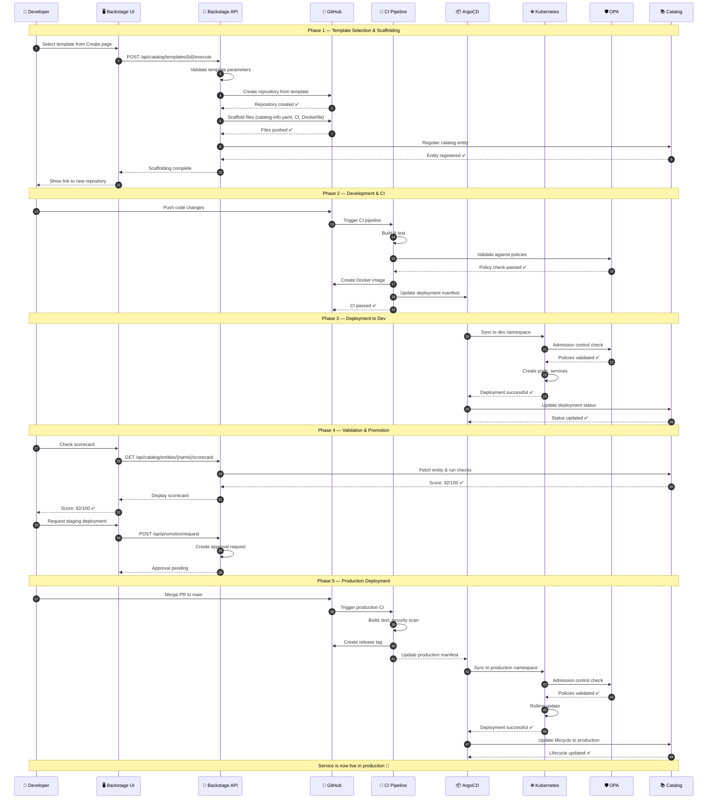

# Service Creation Sequence

Sequence diagram showing the flow from template selection to production deployment.

## Phase Details

### Phase 1: Template Selection & Scaffolding
- Developer selects template from Backstage UI
- Backstage API validates parameters against template schema
- Repository created on GitHub with all scaffolding
- Catalog entity automatically registered
- CI/CD pipelines pre-configured

### Phase 2: Development & CI
- Developer pushes code changes
- CI pipeline triggers automatically
- Build, lint, and test stages execute
- OPA validates against organizational policies
- Docker image built and pushed to registry

### Phase 3: Deployment to Dev
- ArgoCD detects manifest change
- Kyverno validates admission control policies
- Pods created in dev namespace
- Health checks verified
- Deployment status recorded in catalog

### Phase 4: Validation & Promotion
- Scorecard runs against the service
- All 10 production readiness checks evaluated
- Score ≥ 80 required for promotion
- Staging deployment requires approval

### Phase 5: Production Deployment
- PR merge triggers production deployment
- Full CI pipeline runs (build, test, security scan)
- ArgoCD syncs to production namespace
- Rolling update with zero downtime
- Service lifecycle updated to `production`
