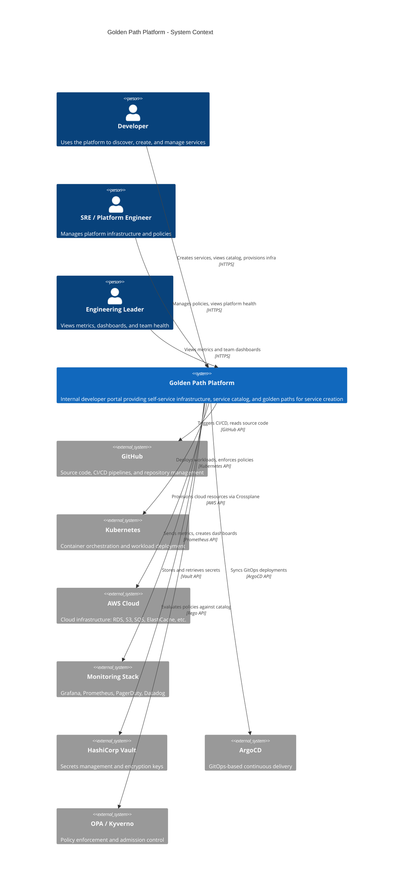

# System Context Diagram

C4 Level 1: System context showing the Golden Path Platform and its interactions with users and external systems.

## Description

The **Golden Path Platform** sits at the center of the developer experience:

- **Developers** interact with the platform through Backstage UI to discover services, create new ones from templates, provision infrastructure via claims, and view production readiness scores
- **SREs / Platform Engineers** manage the platform itself — policies, compositions, templates, and infrastructure
- **Engineering Leaders** use dashboards and scorecards to track team health and adoption metrics

The platform integrates with external systems:
- **GitHub** for source control, CI/CD pipelines, and repository management
- **Kubernetes** for container orchestration and workload deployment
- **AWS** for cloud infrastructure provisioned via Crossplane
- **Monitoring Stack** for observability, alerting, and incident management
- **Vault** for secrets management
- **ArgoCD** for GitOps-based continuous delivery
- **OPA / Kyverno** for policy enforcement at catalog and Kubernetes levels
